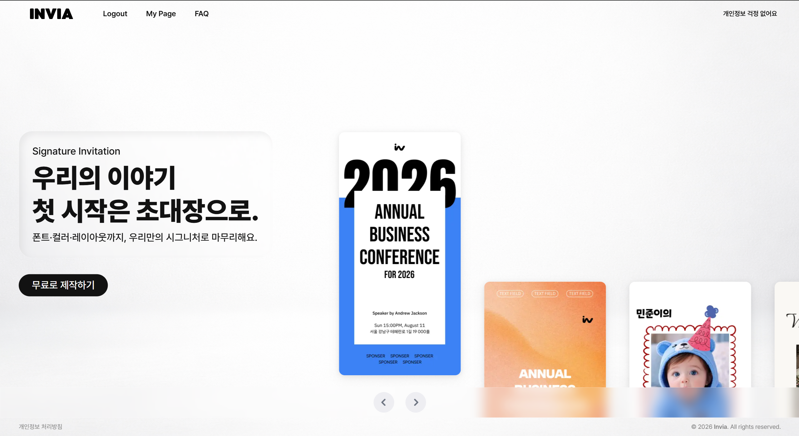

<div align="center">

<!-- logo -->


### 💌 모바일 초대장 서비스 Invia

[](https://invia.co.kr) [](https://github.com/Bread-Barbershop/frontend) []()

</div>

## 📝 소개

누구나 무료로 만들 수 있는 **감성적인 모바일 초대장 서비스**입니다.

디자인 제한도, 이용료 부담도 없이 자신만의 스타일로 쉽게 꾸미고 공유할 수 있는 공간을 제공합니다.
결혼식부터 생일, 세미나, 행사까지 — 다양한 순간을 표현할 수 있는 **새로운 초대 문화**를 만들어가고 있습니다.

### ✨ 주요 기능

- **초대장 에디터** — Fabric.js 기반 캔버스에서 포스터 커버 직접 디자인 (텍스트, 이미지, 도형, 배경)
- **블록 기반 구성** — 인사말, 갤러리, 캘린더, 장소, 계좌, 연락처 등 19종 블록으로 유연하게 구성
- **Google Drive 연동** — 초대장 데이터를 사용자 본인의 Google Drive에 저장 (서버 DB 불필요)
- **게스트 뷰어** — 공개 링크로 게스트가 편하게 초대장 확인 (모바일 최적화)
- **카카오톡 공유** — 메타데이터 포함 OG 이미지로 감성적인 초대장 공유

<br/>

### 🖥️ 화면 구성

|                                                    홈 (쇼케이스)                                                    |                      에디터 (포스터 + 블록)                      |
| :-----------------------------------------------------------------------------------------------------------------: | :--------------------------------------------------------------: |
|                                                           |       |
|                                          초대장 예시 캐러셀 + 서비스 소개                                           |            Fabric.js 캔버스 + 초대장 블럭 추가, 수정             |
|                                                   **게스트 뷰어**                                                   |                           **대시보드**                           |
|   |  |
|                                                    게스트 페이지                                                    |              내 초대장 목록 관리, 공개/비공개 전환               |

<br/>

## 📁 아키텍처

```
frontend/
├── app/                              # Next.js App Router
│   ├── page.tsx                      # 홈 페이지 (쇼케이스 캐러셀)
│   ├── dashboard/                    # 내 초대장 관리 대시보드
│   ├── editor/[id]/                  # 초대장 에디터 (Fabric.js 캔버스)
│   ├── guest/[id]/                   # 게스트 초대장 뷰어
│   ├── faq/ & policy/                # 정보 페이지
│   ├── api/
│   │   ├── auth/*                    # Google OAuth (로그인/로그아웃)
│   │   ├── drive/*                   # Google Drive API (저장/불러오기)
│   │   ├── place/                    # 네이버 지도 API
│   │   └── map-redirect/             # 지도 리다이렉트
│   ├── layout.tsx                    # 루트 레이아웃
│   └── styles/globals.css
│
├── components/                       # UI 컴포넌트 (Atomic Design)
│   ├── atoms/                        # 버튼, 입력, 라벨 등
│   ├── molecules/                    # 컬러 피커, 에디터, 셀렉터 등
│   └── organisms/                    # 초대장 블록 UI
│
├── features/                         # 기능별 모듈
│   ├── invitation/                   # 초대장 핵심 기능
│   ├── DndKit/ & EmblaCarousel/      # 드래그앤드롭, 캐러셀
│   ├── session/                      # 인증 및 세션 관리
│   └── monitoring/                   # 분석 (Clarity)
│
├── widgets/                          # 페이지 단위 UI 조합
│   ├── editor/                       # 에디터 4-패널 레이아웃
│   └── mainPoster/                   # Fabric.js 캔버스
│
├── shared/                           # 공통 레이어
│   ├── assets/                       # 로고, 이미지, 아이콘
│   ├── config/                       # 레이아웃 설정
│   ├── data/                         # 블록 정보, 템플릿, 샘플
│   ├── hooks/                        # useConfirm, useToast 등
│   ├── store/                        # Zustand 상태 관리
│   │   ├── editorStore/             # 에디터 상태 (블록, 이미지, 공유 등)
│   │   ├── useConfirmStore.ts
│   │   └── useToastStore.ts
│   ├── types/                        # TypeScript 타입 정의
│   └── utils/                        # 유틸 함수
│
└── public/                           # 정적 자산
    ├── assets/                       # 이미지, 아이콘, 음성 파일
    ├── fonts/                        # 커스텀 폰트
    └── templates/                    # 템플릿 자산
```

**주요 데이터 흐름**

1. **로그인**: Google OAuth (PKCE) → 사용자 인증
2. **초대장 작성**: 에디터 UI → Zustand 상태 관리 → Google Drive API 저장
3. **게스트 공유**: 공개 링크 생성 → OG 메타데이터 → 카카오톡/SNS 공유
4. **뷰어 열람**: 게스트 링크 → Google Drive에서 데이터 로드 → 정적 렌더링
5. **모니터링**: Vercel Analytics + Microsoft Clarity

<br/>

## ⚙ 기술 스택

### Front-end

<div>


</div>

**에디터 & 인터랙션**

<div>


</div>

**통합 & 배포**

<div>


</div>

### Tools

<div>


</div>

<br/>

<br/>

## 💁‍♂️ 프로젝트 팀원

### 멘토 & 디자이너

|                                         프로젝트 멘토                                         |                               UI/UX 디자이너                                |
| :-------------------------------------------------------------------------------------------: | :-------------------------------------------------------------------------: |
|  |  |
|                                       [bred](멘토링크)                                        |                           [황준호](디자이너링크)                            |

### 프론트엔드 개발자

|                                                프론트엔드                                                 |                                                 프론트엔드                                                  |                                               프론트엔드                                               |                                                프론트엔드                                                |
| :-------------------------------------------------------------------------------------------------------: | :---------------------------------------------------------------------------------------------------------: | :----------------------------------------------------------------------------------------------------: | :------------------------------------------------------------------------------------------------------: |
|  |  |  |  |
|                                  [황유정](https://github.com/YooJeong01)                                  |                                  [백효영](https://github.com/HyoYoung0829)                                  |                                  [김영민](https://github.com/kimym98)                                  |                                  [김현빈](https://github.com/hb-k-3376)                                  |

**팀 소개**: 브레드 이발소 (Bread Barbershop)

- **이메일**: teambread.official@gmail.com
- **GitHub**: [Bread-Barbershop](https://github.com/Bread-Barbershop)
- **서비스**: https://invia.co.kr

---

## 📄 라이센스 & 기타

- **개인정보처리방침**: [정책 페이지](https://invia.co.kr/policy)
- **FAQ**: [자주 묻는 질문](https://invia.co.kr/faq)

<div align="center">

누구나 자신의 순간을 더 예쁘고 자연스럽게 표현할 수 있는 세상을 꿈꿉니다. ✨

</div>
