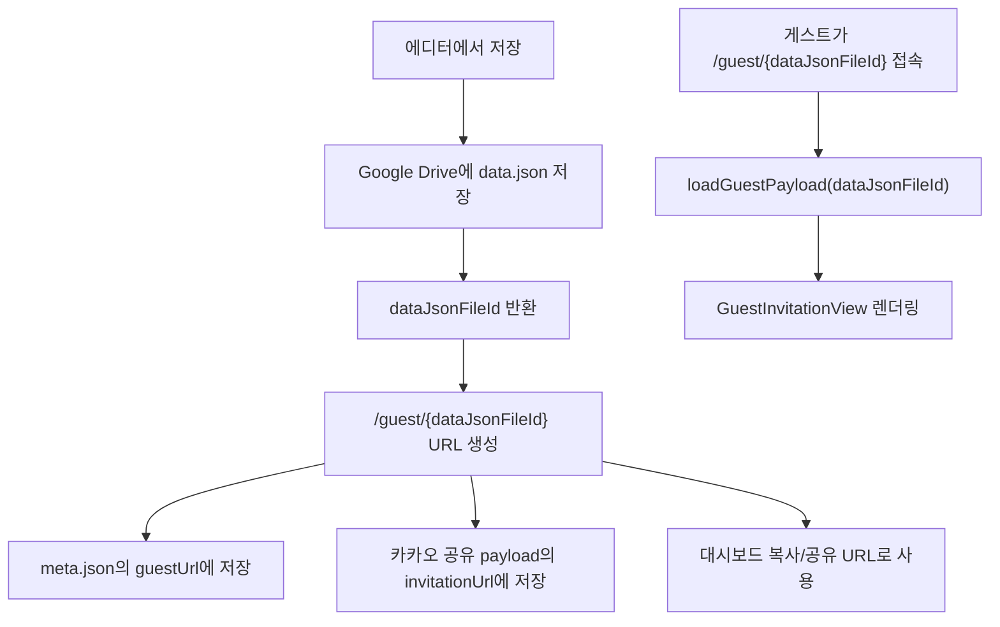
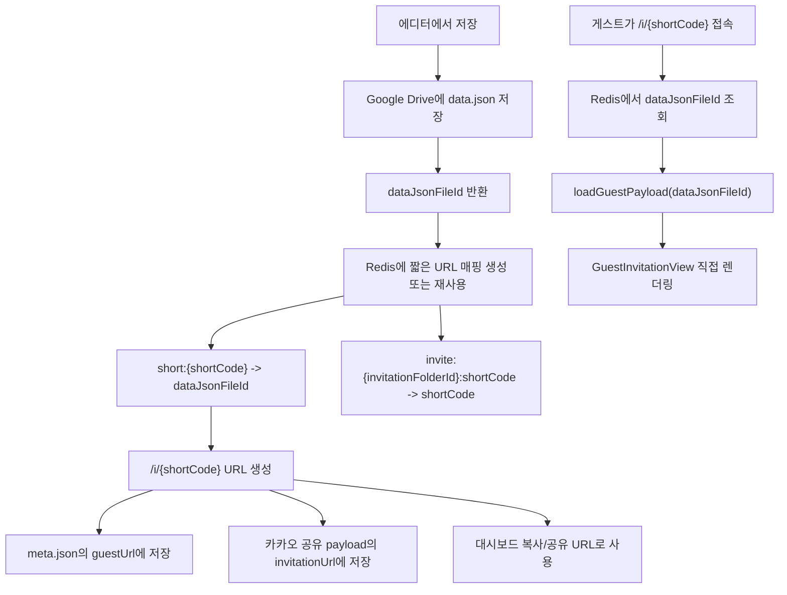

# 게스트 짧은 URL 매핑 기능 개발 기획서

## 1. 목표

현재 게스트 초대장 URL은 Google Drive의 `data.json` 파일 ID를 그대로 사용한다.

```text
/guest/{dataJsonFileId}
```

이 URL은 너무 길고 외부 공유에 적합하지 않으므로, 외부 저장소인 Upstash Redis를 사용해 짧은 URL을 제공한다.

```text
/i/{shortCode}
```

게스트가 짧은 URL로 들어오면 Redis에서 실제 `dataJsonFileId`를 찾고, 기존 게스트 렌더링 로직을 그대로 호출한다.

중요한 방향은 **리다이렉트가 아니라 직접 렌더링**이다. 즉, 사용자의 주소창과 카카오톡 공유 링크는 계속 `/i/{shortCode}`로 유지된다.

---

## 2. 현재 구조 요약



현재 핵심 파일:

- `features/invitation/save/saveInvitationFlow.ts`
  - 저장 완료 후 게스트 URL 생성
  - `/api/drive/shareUrl` 호출
- `app/api/drive/shareUrl/route.ts`
  - `meta.json.guestUrl`
  - `kakaoShare.invitationUrl`
- `app/guest/[id]/page.tsx`
  - 게스트 페이지 렌더링
- `app/guest/[id]/server/loadGuestPayload.ts`
  - Drive의 공개 `data.json` 로딩
- `app/dashboard/hooks/useDashboardInvitations.ts`
  - 대시보드 복사, 카카오 공유
- `app/api/drive/invitationVisibility/route.ts`
  - 공개/비공개 전환 시 `guestUrl` 응답
- `app/api/drive/guestReadiness/route.ts`
  - 공개 직후 Drive 파일 읽기 가능 여부 확인

---

## 3. 목표 구조



---

## 4. Redis 저장 방식

사용 저장소:

```text
Upstash Redis
```

필요 환경변수:

```text
UPSTASH_REDIS_REST_URL
UPSTASH_REDIS_REST_TOKEN
```

Vercel Marketplace/Storage 연결에서 아래 이름으로 들어오는 경우도 함께 지원한다.

```text
KV_REST_API_URL
KV_REST_API_TOKEN
```

저장할 key:

```text
short:{shortCode} -> dataJsonFileId
invite:{invitationFolderId}:shortCode -> shortCode
```

예시:

```text
short:aB7k -> 1A2B3C4D_google_drive_file_id
invite:folder_123:shortCode -> aB7k
```

설계 이유:

- `short:{shortCode}`는 짧은 URL 접근 시 실제 Drive 파일 ID를 찾기 위해 필요하다.
- `invite:{invitationFolderId}:shortCode`는 같은 초대장을 다시 저장할 때 기존 짧은 URL을 재사용하기 위해 필요하다.
- 저장할 때마다 URL이 바뀌면 이미 공유한 카카오톡 링크나 문자 링크가 불안정해지므로, 같은 초대장은 같은 short code를 유지한다.
- 신규 short code는 4글자로 생성한다. 기존에 더 긴 code가 이미 발급된 경우에도 `/i/[code]` 라우트는 계속 처리할 수 있게 둔다.

---

## 5. 구현 단계

### Step 1. 한글 기획서 확정

작업 내용:

- 이 문서를 기준으로 전체 방향을 확정한다.
- URL이 영향을 받는 지점을 빠짐없이 체크한다.
- 2차 개선 범위는 제외한다.

완료 기준:

- `/i/{shortCode}` 직접 렌더링 방식으로 확정
- Upstash Redis 사용 확정
- 기존 `/guest/{dataJsonFileId}`는 유지하기로 확정

---

### Step 2. Redis helper 추가

작업 내용:

- 서버 전용 Redis helper를 만든다.
- Upstash REST API를 사용한다.
- 환경변수가 없으면 기능을 비활성화하고 기존 긴 URL fallback을 사용한다.

필요 함수 예시:

```text
isShortUrlStoreConfigured()
getOrCreateShortCode(invitationFolderId, dataJsonFileId)
resolveShortCode(shortCode)
deleteShortCodeMapping(invitationFolderId)
```

주의사항:

- Redis 장애 때문에 초대장 저장이 실패하면 안 된다.
- short code 생성 시 `SET NX` 방식으로 충돌을 방지한다.
- 충돌이 나면 새 short code를 만들어 재시도한다.

완료 기준:

- Redis가 설정된 경우 short code 생성 가능
- Redis가 설정되지 않은 경우 기존 `/guest/{id}` 사용
- 단위 테스트로 fallback 동작 확인

---

### Step 3. `/i/[code]` 게스트 페이지 추가

작업 내용:

- `app/i/[code]/page.tsx`를 추가한다.
- `code`로 Redis를 조회해 `dataJsonFileId`를 얻는다.
- 기존 `loadGuestPayload(dataJsonFileId)`를 호출한다.
- 기존 `GuestInvitationView`로 직접 렌더링한다.

흐름:

```text
/i/aB7k
-> Redis 조회
-> dataJsonFileId 획득
-> loadGuestPayload(dataJsonFileId)
-> GuestInvitationView 렌더링
```

주의사항:

- 여기서 `/guest/{id}`로 redirect하지 않는다.
- 주소창은 `/i/{code}`로 남아야 한다.
- `generateMetadata`도 기존 `/guest/[id]`와 같은 방식으로 맞춰야 한다.
- Redis에 code가 없으면 `notFound()` 처리한다.
- Drive 파일이 비공개면 기존 비공개 안내 UI와 동일하게 처리한다.

완료 기준:

- `/i/{code}` 접속 시 초대장이 직접 렌더링됨
- 카카오톡/메신저 preview용 metadata가 기존과 동일하게 생성됨
- 잘못된 code는 404 처리됨

---

### Step 4. 저장 시 짧은 URL 생성 및 저장

작업 내용:

- `saveInvitationFlow.ts`에서 `/guest/{dataJsonFileId}`를 최종 공유 URL로 바로 확정하지 않는다.
- `/api/drive/shareUrl`에 `invitationFolderId`, `dataJsonFileId`, 기존 shareData를 보낸다.
- 서버에서 short code를 생성하거나 기존 code를 재사용한다.
- 최종 `guestUrl`과 `shareData.invitationUrl`을 `/i/{shortCode}`로 저장한다.

주의사항:

- `dataJsonFileId`는 여전히 별도로 보관해야 한다.
- `guestUrl`만 짧은 URL로 바꾼다.
- Drive readiness 체크에는 short code를 사용하면 안 된다.
- `/api/drive/shareUrl` 응답에서 최종 URL을 받아 `saveInvitationFlow`의 결과 `guestUrl`에도 반영해야 한다.

완료 기준:

- 새 저장 결과의 `guestUrl`이 `/i/{shortCode}`로 반환됨
- `meta.json.guestUrl`이 `/i/{shortCode}`로 저장됨
- `meta.json.kakaoShare.invitationUrl`이 `/i/{shortCode}`로 저장됨

---

### Step 5. 카카오톡 공유 영향 범위 확인

작업 내용:

- 대시보드에서 카카오 공유 시 `shareData.invitationUrl`을 사용한다.
- 해당 값이 반드시 짧은 URL인지 확인한다.
- 카카오 feed content link와 버튼 link가 모두 같은 짧은 URL을 사용해야 한다.

영향 지점:

```text
app/dashboard/hooks/useDashboardInvitations.ts
```

확인해야 할 링크:

- `content.link.mobileWebUrl`
- `content.link.webUrl`
- "보러가기" 버튼의 `mobileWebUrl`
- "보러가기" 버튼의 `webUrl`

주의사항:

- 대시보드 복사 URL만 바꾸고 카카오 공유 URL을 놓치면 안 된다.
- 카카오톡 미리보기는 페이지 metadata를 보므로 `/i/[code]`의 metadata도 반드시 맞춰야 한다.
- 위치보기 버튼은 지도 URL이므로 이번 짧은 URL 매핑 대상이 아니다.

완료 기준:

- 카카오톡 공유 링크가 `/i/{shortCode}`를 사용함
- 카카오톡 미리보기 title, description, image가 기존과 동일하게 동작함
- 위치보기 버튼은 기존 동작 유지

---

### Step 6. 대시보드 복사/공유 URL 확인

작업 내용:

- 대시보드 목록은 `meta.json.guestUrl`을 읽어온다.
- 이 값이 짧은 URL이면 복사 버튼도 자동으로 짧은 URL을 사용한다.
- pending invitation handoff에서도 짧은 URL이 유지되는지 확인한다.

영향 지점:

- `app/dashboard/server/loadDashboardInvitations.ts`
- `app/dashboard/hooks/dashboardInvitationState.ts`
- `app/dashboard/hooks/useDashboardInvitations.ts`
- `shared/constants/dashboardPendingInvitation.ts`
- `widgets/editor/preview/hooks/useInvitationUpload.ts`

주의사항:

- 상대 경로 `/i/{code}`는 클라이언트에서 `window.location.origin`과 합쳐져야 한다.
- 기존 `/guest/{id}` 링크가 meta에 남아 있는 오래된 초대장은 그대로 동작하게 둔다.

완료 기준:

- 대시보드 복사 버튼이 전체 짧은 URL을 복사함
- 저장 직후 대시보드로 이동해도 pending 카드가 짧은 URL을 유지함
- 기존 긴 URL 초대장도 계속 표시 및 복사 가능

---

### Step 7. 공개/비공개 및 readiness 응답 정리

작업 내용:

- 공개/비공개 전환 API 응답의 `guestUrl`도 가능하면 짧은 URL을 사용한다.
- 단, readiness 체크는 반드시 `dataJsonFileId`로 한다.

영향 지점:

- `app/api/drive/invitationVisibility/route.ts`
- `app/api/drive/guestReadiness/route.ts`
- `app/api/drive/_lib/guestReadiness.ts`

주의사항:

- `guestPath(dataJsonFileId)`는 기존 `/guest/{id}`를 만들기 위한 내부 fallback으로 남겨도 된다.
- 공개 여부 확인과 Drive 파일 probing에는 short code가 아니라 Drive file id가 필요하다.
- Redis 조회 실패 시에도 공개/비공개 변경 자체는 실패하면 안 된다.

완료 기준:

- 공개 전환 후 응답의 `guestUrl`이 가능한 경우 `/i/{code}`임
- readiness polling은 기존처럼 `dataJsonFileId`로 동작함
- 비공개 전환 후에도 짧은 URL 접속 시 기존 비공개 안내 UI가 보임

---

### Step 8. 삭제 시 Redis 매핑 정리

작업 내용:

- 초대장 삭제 시 Redis 매핑도 정리한다.
- Drive 폴더 삭제 성공 후 Redis key 삭제를 시도한다.

삭제 대상:

```text
invite:{invitationFolderId}:shortCode
short:{shortCode}
```

주의사항:

- Redis 삭제 실패 때문에 Drive 삭제 성공을 실패로 바꾸지는 않는다.
- 삭제 실패는 로그만 남긴다.
- 이미 삭제된 mapping이면 조용히 통과한다.

완료 기준:

- 초대장 삭제 후 해당 `/i/{code}`는 더 이상 resolve되지 않음
- Redis 삭제 실패가 사용자 삭제 플로우를 막지 않음

---

### Step 9. 테스트

필수 테스트:

- Redis 미설정 시 기존 `/guest/{id}` fallback
- short code 생성 성공 시 `/i/{code}` 저장
- 같은 초대장 재저장 시 같은 short code 재사용
- `/i/{code}`가 기존 게스트 페이지와 동일하게 렌더링
- `/i/{code}` metadata가 기존과 동일하게 생성
- 카카오 공유 payload의 `invitationUrl`이 짧은 URL로 저장
- readiness는 계속 `dataJsonFileId`를 사용
- 삭제 시 Redis key 정리 시도

완료 기준:

- 관련 Jest 테스트 통과
- 기존 guest page 테스트 유지
- 기존 dashboard 공유 테스트 업데이트

---

## 6. URL 영향 범위 체크리스트

아래 항목은 구현 중 반드시 하나씩 확인한다.

- [ ] 저장 결과 `saveResult.guestUrl`
- [ ] `meta.json.guestUrl`
- [ ] `meta.json.kakaoShare.invitationUrl`
- [ ] 대시보드 카드의 `guestUrl`
- [ ] 대시보드 복사 버튼
- [ ] 카카오톡 feed `content.link.mobileWebUrl`
- [ ] 카카오톡 feed `content.link.webUrl`
- [ ] 카카오톡 "보러가기" 버튼 `mobileWebUrl`
- [ ] 카카오톡 "보러가기" 버튼 `webUrl`
- [ ] 저장 직후 pending invitation sessionStorage
- [ ] 공개 전환 API 응답 `guestUrl`
- [ ] readiness polling 결과 `guestUrl`
- [ ] 기존 `/guest/{dataJsonFileId}` fallback
- [ ] `/i/{shortCode}` metadata
- [ ] 삭제 후 Redis mapping 정리

---

## 7. 이번 범위에서 제외하는 것

이번 작업에서는 아래 기능을 하지 않는다.

- 사용자 지정 slug
- 클릭 수 통계
- 링크 만료 시간
- 비밀번호 보호
- 국가/지역별 Redis 복제 최적화
- rate limit
- 관리자용 short URL 검색 UI
- 정확한 방문자 분석, 중복 제거, 봇 필터링

필요해지면 2차 개선으로 분리한다.

---

## 8. 최종 완료 기준

- Upstash Redis가 설정된 운영 환경에서는 새 초대장의 공유 URL이 `/i/{shortCode}`로 생성된다.
- 게스트가 `/i/{shortCode}`로 들어오면 리다이렉트 없이 초대장이 직접 렌더링된다.
- 카카오톡 공유 링크와 미리보기가 기존과 동일하게 동작한다.
- 대시보드 복사 링크가 짧은 URL을 복사한다.
- 공개/비공개 전환과 readiness 확인은 기존처럼 안정적으로 동작한다.
- Upstash Redis가 미설정이거나 장애가 있어도 저장은 기존 `/guest/{dataJsonFileId}` 방식으로 계속 동작한다.
- 기존에 공유된 `/guest/{dataJsonFileId}` 링크는 계속 동작한다.
