# 게스트 페이지 리팩토링 보고서

## 1. 목적

게스트 페이지는 초대장 링크를 받은 하객이 접속하는 공개 페이지다. 이 페이지는 로그인 없이 누구에게나 동일한 내용을 빠르게 보여줘야 하고, 운영 비용을 최소화해야 한다.

이번 리팩토링의 목표는 다음과 같다.

- 하객이 초대장 링크에 접속했을 때 첫 화면이 빠르게 보이도록 한다.
- Google Drive 공개 파일 기반 구조를 유지하면서 Vercel 이미지 최적화/CDN 비용을 불필요하게 쓰지 않는다.
- 잘못된 초대장, 비공개 초대장, 깨진 `data.json`으로 인해 이상한 화면이나 예외 화면에 빠지지 않게 한다.
- 새 컴포넌트가 추가될 때마다 게스트 타입 가드를 수동으로 고치는 구조를 줄인다.
- 현재 정상 동작 중인 저장/공유/게스트 렌더링 흐름을 유지하면서 점진적으로 개선한다.

---

## 2. 현재 구조 요약

현재 게스트 페이지의 주요 파일은 아래에 있다.

```txt
app/guest/[id]/
  page.tsx
  components/
    GuestRenderer.tsx
    GuestMainPoster.tsx
    GuestBgm.tsx
  types/
    guestTypes.ts
  utils/
    guestBlockTypeGuards.ts
```

게스트 페이지는 `/guest/{dataJsonFileId}` 형태로 접근한다. `id`는 초대장 UUID가 아니라 Google Drive에 저장된 `data.json` 파일 ID다.

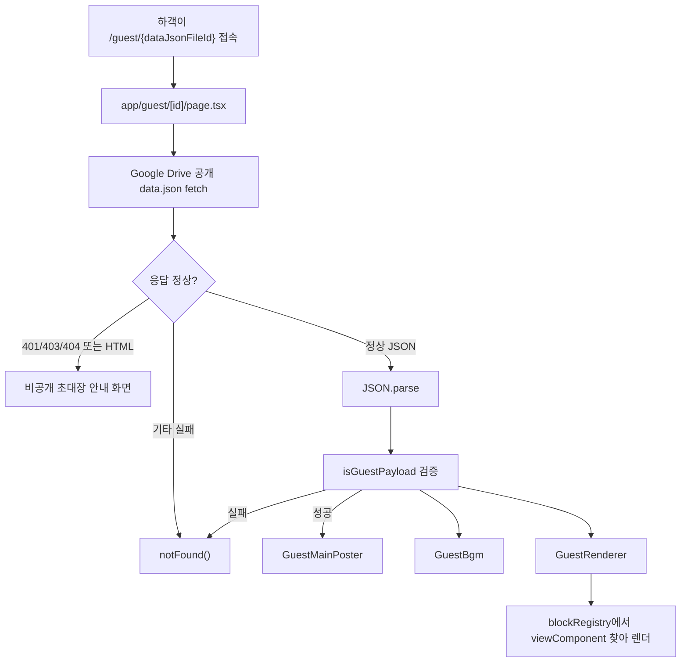
```mermaid
flowchart TD
  A["하객이 /guest/{dataJsonFileId} 접속"] --> B["app/guest/[id]/page.tsx"]
  B --> C["Google Drive 공개 data.json fetch"]
  C --> D{"응답 정상?"}
  D -- "401/403/404 또는 HTML" --> E["비공개 초대장 안내 화면"]
  D -- "기타 실패" --> F["notFound()"]
  D -- "정상 JSON" --> G["JSON.parse"]
  G --> H["isGuestPayload 검증"]
  H -- "실패" --> F
  H -- "성공" --> I["GuestMainPoster"]
  H --> J["GuestBgm"]
  H --> K["GuestRenderer"]
  K --> L["blockRegistry에서 viewComponent 찾아 렌더"]
```

---

## 3. 저장부터 게스트 노출까지의 데이터 흐름

초대장 저장은 `features/invitation/save/saveInvitationFlow.ts`에서 진행된다. 최종적으로 Google Drive에 `data.json`을 저장하고, 그 파일 ID를 게스트 URL로 사용한다.

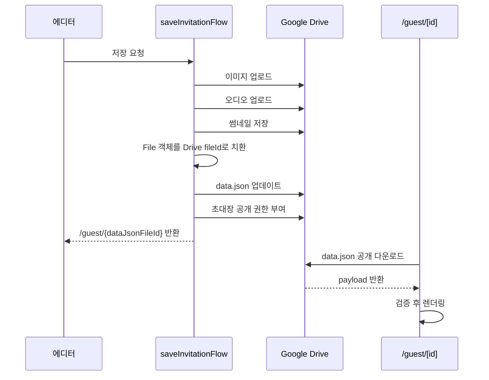
```mermaid
sequenceDiagram
  participant Editor as 에디터
  participant SaveFlow as saveInvitationFlow
  participant Drive as Google Drive
  participant Guest as /guest/[id]

  Editor->>SaveFlow: 저장 요청
  SaveFlow->>Drive: 이미지 업로드
  SaveFlow->>Drive: 오디오 업로드
  SaveFlow->>Drive: 썸네일 저장
  SaveFlow->>SaveFlow: File 객체를 Drive fileId로 치환
  SaveFlow->>Drive: data.json 업데이트
  SaveFlow->>Drive: 초대장 공개 권한 부여
  SaveFlow-->>Editor: /guest/{dataJsonFileId} 반환
  Guest->>Drive: data.json 공개 다운로드
  Drive-->>Guest: payload 반환
  Guest->>Guest: 검증 후 렌더링
```

현재 `data.json`의 핵심 구조는 아래와 같다.

```json
{
  "bulkData": {
    "backgroundColor": "#ffffff",
    "titleData": {},
    "bodyData": {},
    "isZoom": false
  },
  "blocks": [
    {
      "id": "block-id",
      "type": "wedding",
      "component": "gallery",
      "props": {}
    }
  ],
  "shareUrl": {},
  "bgm": {},
  "mainPoster": {
    "version": "1.0.0",
    "objects": [],
    "thumbnailFileId": "drive-file-id"
  }
}
```

---

## 4. 이미지 로딩 정책

현재 프로젝트는 Google Drive fileId를 직접 공개 URL로 변환해서 이미지로 사용한다. 핵심 유틸은 `shared/utils/media/driveImageUtils.ts`다.

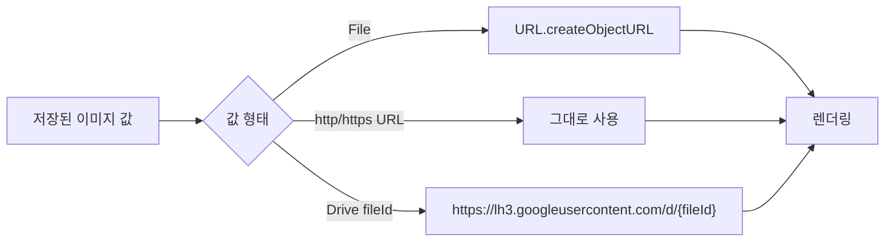
```mermaid
flowchart LR
  A["저장된 이미지 값"] --> B{"값 형태"}
  B -- "File" --> C["URL.createObjectURL"]
  B -- "http/https URL" --> D["그대로 사용"]
  B -- "Drive fileId" --> E["https://lh3.googleusercontent.com/d/{fileId}"]
  C --> F["렌더링"]
  D --> F
  E --> F
```

`components/atoms/image/Image.tsx`는 Google Drive 또는 Google user content URL이면 `next/image`의 최적화 프록시를 우회하도록 `unoptimized`를 자동 적용한다.

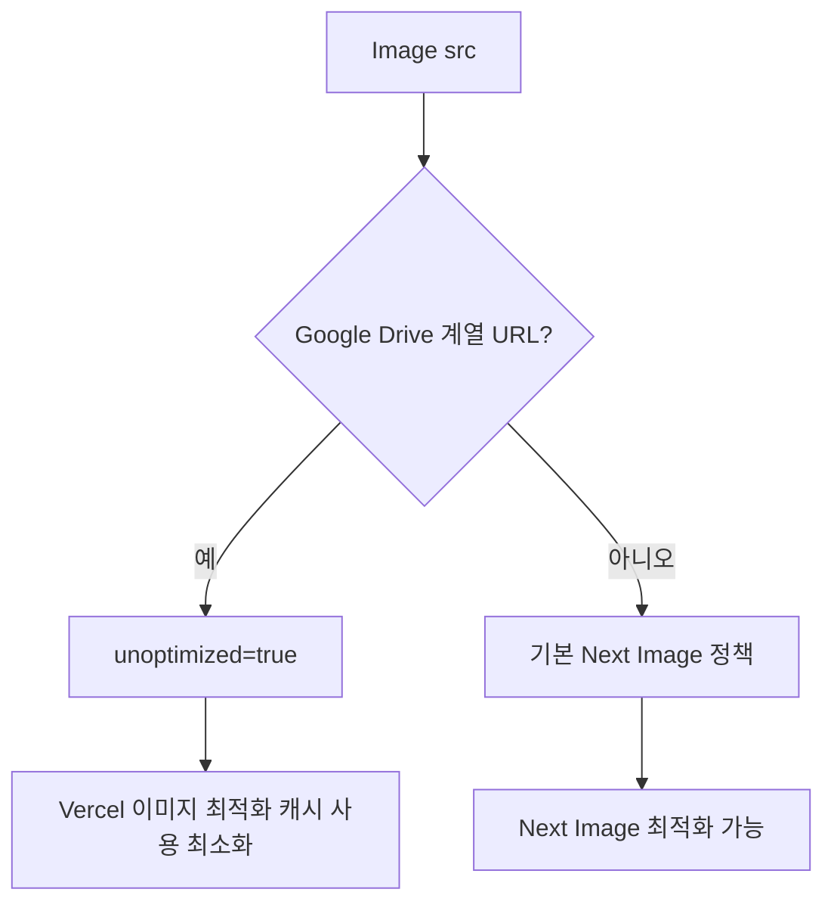
```mermaid
flowchart TD
  A["Image src"] --> B{"Google Drive 계열 URL?"}
  B -- "예" --> C["unoptimized=true"]
  B -- "아니오" --> D["기본 Next Image 정책"]
  C --> E["Vercel 이미지 최적화 캐시 사용 최소화"]
  D --> F["Next Image 최적화 가능"]
```

현재 정책은 무비용 운영 관점에서 방향이 맞다. 다만 문서와 실제 구현이 일부 다르게 보인다. `IMAGE_SOURCE_RENDER_GUIDE.md`는 예전 `drive.google.com/uc` 변환을 설명하지만, 실제 구현은 `lh3.googleusercontent.com/d/{fileId}`를 사용한다. 리팩토링 시 문서도 함께 갱신해야 한다.

---

## 5. 현재 타입 가드 구조

현재 `isGuestPayload`는 최상위 payload의 필수 구조만 검사한다.

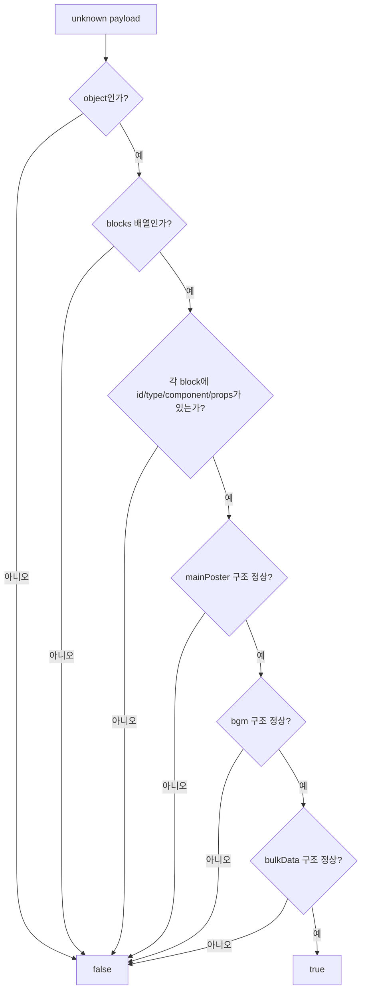
```mermaid
flowchart TD
  A["unknown payload"] --> B{"object인가?"}
  B -- "아니오" --> X["false"]
  B -- "예" --> C{"blocks 배열인가?"}
  C -- "아니오" --> X
  C -- "예" --> D{"각 block에 id/type/component/props가 있는가?"}
  D -- "아니오" --> X
  D -- "예" --> E{"mainPoster 구조 정상?"}
  E -- "아니오" --> X
  E -- "예" --> F{"bgm 구조 정상?"}
  F -- "아니오" --> X
  F -- "예" --> G{"bulkData 구조 정상?"}
  G -- "아니오" --> X
  G -- "예" --> Y["true"]
```

장점:

- 단순하고 빠르다.
- 블록별 상세 props를 모르더라도 새 컴포넌트를 막지 않는다.
- 현재 테스트가 안정적으로 통과한다.

한계:

- `component`가 실제 registry에 존재하는지 검사하지 않는다.
- `props`가 각 컴포넌트의 필수 필드를 만족하는지 검사하지 않는다.
- 유효하지 않은 block은 `GuestRenderer`에서 조용히 사라질 수 있다.
- 가드가 최상위 구조에만 집중되어 있어서 “튼튼함”이 제한적이다.

---

## 6. 현재 블록 registry 구조

프로젝트에는 이미 컴포넌트 확장을 위한 registry가 있다.

```txt
shared/data/registry/
  block.schema.ts
  registry.ts
```

각 컴포넌트는 보통 두 파일을 가진다.

```txt
components/organisms/gallery/
  Gallery.schema.ts
  Gallery.definition.ts
  Gallery.tsx
  GalleryPreview.tsx
```

현재 연결 구조는 아래와 같다.

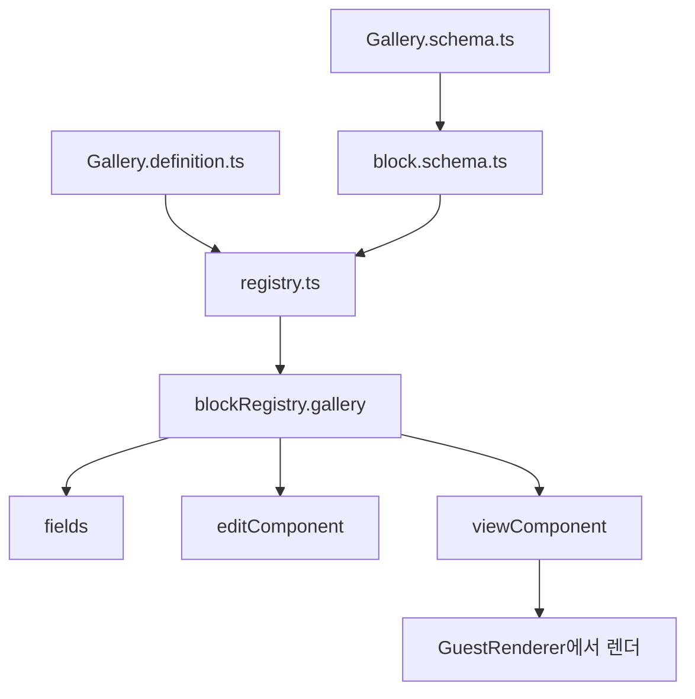
```mermaid
flowchart TD
  A["Gallery.schema.ts"] --> C["block.schema.ts"]
  B["Gallery.definition.ts"] --> D["registry.ts"]
  C --> D
  D --> E["blockRegistry.gallery"]
  E --> F["fields"]
  E --> G["editComponent"]
  E --> H["viewComponent"]
  H --> I["GuestRenderer에서 렌더"]
```

이 구조를 활용하면 타입 가드를 수동으로 계속 늘리지 않아도 된다. 리팩토링의 핵심은 `guestBlockTypeGuards.ts`가 개별 컴포넌트 지식을 직접 갖는 것이 아니라, `blockRegistry`와 `blockSchema`를 기반으로 검증하도록 만드는 것이다.

---

## 7. 리팩토링 방향

### 방향 A. 게스트 payload 검증을 2단계로 분리

현재는 `isGuestPayload` 하나가 모든 결정을 한다. 리팩토링 후에는 다음처럼 나눈다.

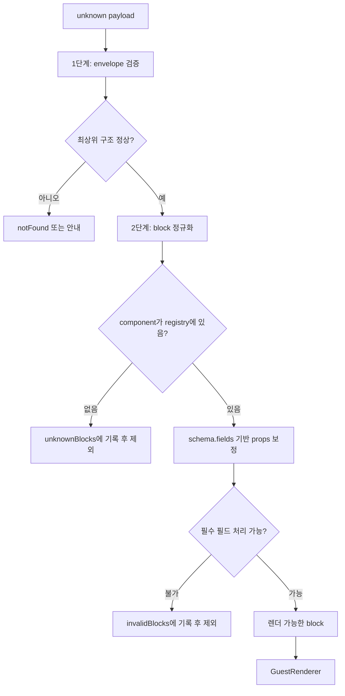
```mermaid
flowchart TD
  A["unknown payload"] --> B["1단계: envelope 검증"]
  B --> C{"최상위 구조 정상?"}
  C -- "아니오" --> X["notFound 또는 안내"]
  C -- "예" --> D["2단계: block 정규화"]
  D --> E{"component가 registry에 있음?"}
  E -- "없음" --> F["unknownBlocks에 기록 후 제외"]
  E -- "있음" --> G["schema.fields 기반 props 보정"]
  G --> H{"필수 필드 처리 가능?"}
  H -- "불가" --> I["invalidBlocks에 기록 후 제외"]
  H -- "가능" --> J["렌더 가능한 block"]
  J --> K["GuestRenderer"]
```

권장 API 형태:

```ts
type GuestPayloadParseResult =
  | {
      ok: true;
      payload: NormalizedGuestPayload;
      warnings: GuestPayloadWarning[];
    }
  | {
      ok: false;
      reason: GuestPayloadFailureReason;
      details?: unknown;
    };

export function parseGuestPayload(input: unknown): GuestPayloadParseResult;
```

`isGuestPayload`는 유지하되 내부적으로 `parseGuestPayload(input).ok`를 사용하도록 바꾸면 기존 호출부 변경을 줄일 수 있다.

### 방향 B. 최상위는 엄격하게, 블록 props는 schema 기반으로 유연하게

최상위 구조는 페이지 전체 렌더링에 필수라 엄격해야 한다.

- `bulkData`
- `blocks`
- `bgm`
- `mainPoster`

반면 블록 props는 컴포넌트가 늘어날수록 계속 변한다. 따라서 수동 타입 가드보다 schema 기반 정규화가 적합하다.

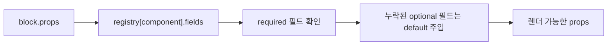
```mermaid
flowchart LR
  A["block.props"] --> B["registry[component].fields"]
  B --> C["required 필드 확인"]
  C --> D["누락된 optional 필드는 default 주입"]
  D --> E["렌더 가능한 props"]
```

예시 정책:

| 상황                                  | 처리                             |
| ------------------------------------- | -------------------------------- |
| 알 수 없는 component                  | 렌더 제외, warning 기록          |
| required 필드가 없지만 default가 있음 | default 주입                     |
| required 필드가 없고 default도 없음   | 해당 block 렌더 제외             |
| optional 필드 없음                    | default 주입 또는 생략           |
| props가 object가 아님                 | 해당 block 렌더 제외             |
| field 외 추가 값 있음                 | 유지, forward compatibility 확보 |

이 정책을 쓰면 새 컴포넌트를 추가할 때 필요한 작업은 아래로 줄어든다.

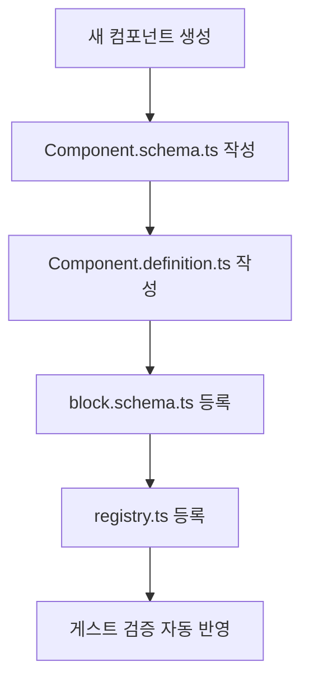
```mermaid
flowchart TD
  A["새 컴포넌트 생성"] --> B["Component.schema.ts 작성"]
  B --> C["Component.definition.ts 작성"]
  C --> D["block.schema.ts 등록"]
  D --> E["registry.ts 등록"]
  E --> F["게스트 검증 자동 반영"]
```

### 방향 C. 게스트 렌더러는 검증된 block만 받게 만들기

현재 `GuestRenderer`는 `blockRegistry[block.component]`를 매번 찾고, 없으면 `null`을 반환한다.

리팩토링 후에는 페이지 진입부에서 이미 정규화된 block만 넘기는 구조가 좋다.

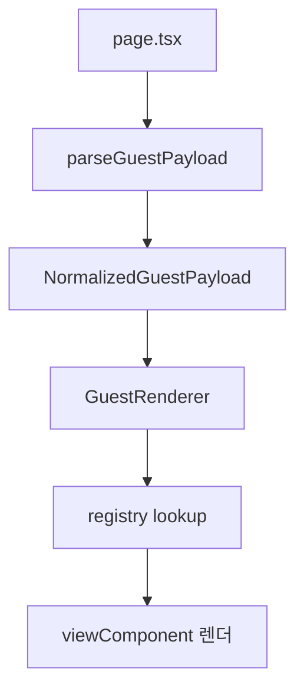
```mermaid
flowchart TD
  A["page.tsx"] --> B["parseGuestPayload"]
  B --> C["NormalizedGuestPayload"]
  C --> D["GuestRenderer"]
  D --> E["registry lookup"]
  E --> F["viewComponent 렌더"]
```

처음에는 `GuestRenderer`의 방어 로직을 남긴다. 이후 안정화되면 renderer는 “검증된 데이터만 받는다”는 계약으로 단순화할 수 있다.

---

## 8. 로딩 최적화 방향

### 8.1 data.json fetch 중복 줄이기

현재 `generateMetadata`와 `GuestPage`가 각각 Drive에서 `data.json`을 fetch한다.

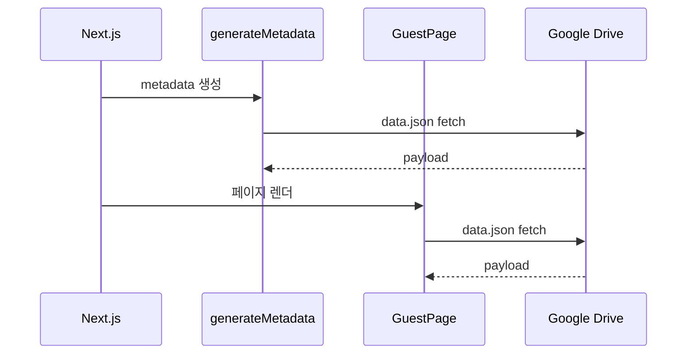
```mermaid
sequenceDiagram
  participant Next as Next.js
  participant Meta as generateMetadata
  participant Page as GuestPage
  participant Drive as Google Drive

  Next->>Meta: metadata 생성
  Meta->>Drive: data.json fetch
  Drive-->>Meta: payload
  Next->>Page: 페이지 렌더
  Page->>Drive: data.json fetch
  Drive-->>Page: payload
```

개선 방향:

- `loadGuestPayload(id)` 서버 함수를 만든다.
- `React.cache` 또는 Next fetch dedupe가 확실히 동작하도록 같은 함수와 같은 fetch 옵션을 쓴다.
- parse, private 응답 감지, JSON parse, schema 검증을 한 곳으로 모은다.

권장 구조:

```txt
app/guest/[id]/
  server/
    loadGuestPayload.ts
    guestDataUrl.ts
  utils/
    parseGuestPayload.ts
```

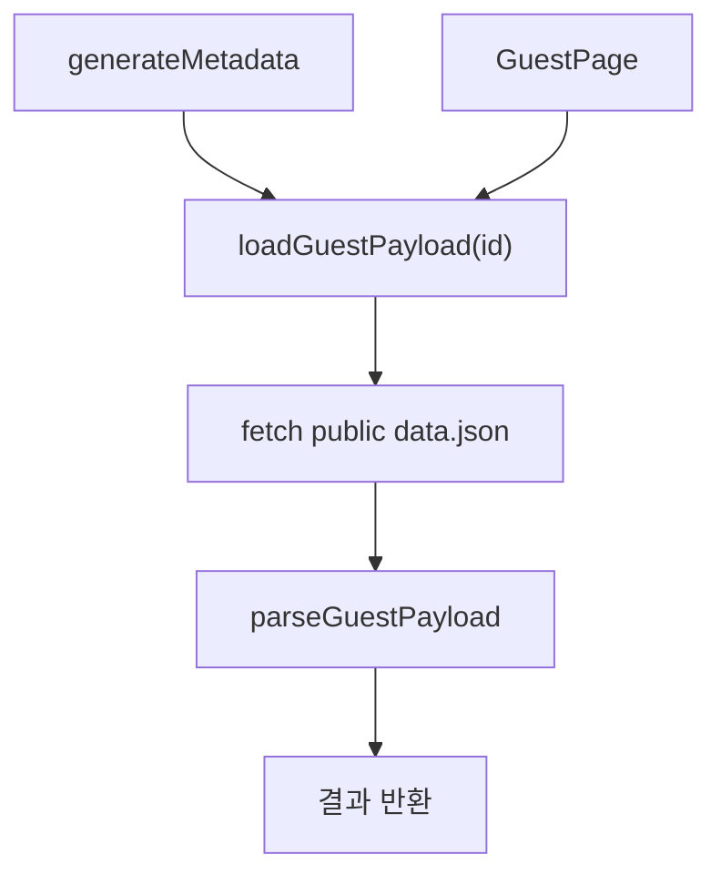
```mermaid
flowchart TD
  A["generateMetadata"] --> C["loadGuestPayload(id)"]
  B["GuestPage"] --> C
  C --> D["fetch public data.json"]
  D --> E["parseGuestPayload"]
  E --> F["결과 반환"]
```

### 8.2 캐시 정책 명확화

현재 `page.tsx`는 `dynamic = 'force-static'`, `revalidate = false`다. 이 설정은 공개 초대장처럼 모두에게 동일한 페이지를 보여주는 데 유리하지만, 초대장 수정 후 반영 시점이 불명확해질 수 있다.

검토할 정책은 두 가지다.

| 정책                   | 장점                   | 단점                        |
| ---------------------- | ---------------------- | --------------------------- |
| 정적 캐시 유지         | 빠름, 비용 적음        | 수정 반영 제어 필요         |
| `revalidate` 시간 부여 | 일정 시간 후 자동 갱신 | 초대장 수정 직후 stale 가능 |

권장 방향:

1. 게스트 페이지는 정적 캐시 방향을 유지한다.
2. 저장 성공 후 `dataJsonFileId` 기준으로 캐시 무효화가 가능한지 확인한다.
3. 불가능하거나 복잡하면 `data.json` fetch에 버전 값을 붙이는 방식도 검토한다.

예시:

```txt
/guest/{dataJsonFileId}?v={updatedAt}
```

단, 공유 URL이 바뀌는 문제가 있으므로 우선순위는 낮다. 현재 구조에서는 Drive fileId가 고정되기 때문에 저장 후 즉시 반영을 보장하려면 Next fetch cache와 Drive 응답 cache를 같이 확인해야 한다.

### 8.3 메인 포스터 우선 로딩

현재 메인 포스터는 `thumbnailFileId`를 `lh3.googleusercontent.com/d/{fileId}`로 변환해서 렌더한다.

개선 방향:

- 메인 포스터 이미지는 첫 화면 핵심 자원이므로 `priority` 적용을 검토한다.
- `sizes`를 게스트 페이지 폭에 맞춰 고정한다.
- `fetchPriority="high"` 적용 가능 여부를 확인한다.
- 이미지 로딩 실패 시 빨간 디버그 UI 대신 하객용 fallback UI를 제공한다.

현재 구조:

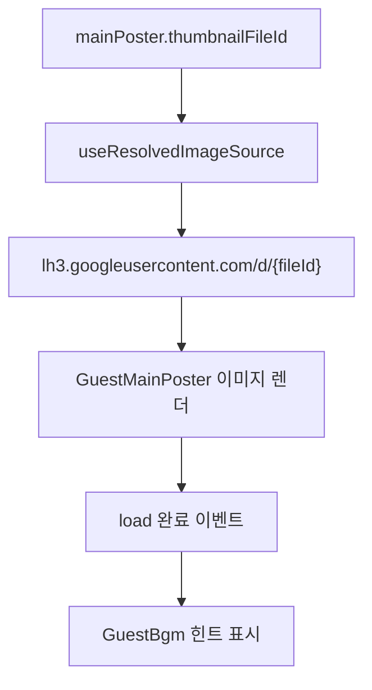
```mermaid
flowchart TD
  A["mainPoster.thumbnailFileId"] --> B["useResolvedImageSource"]
  B --> C["lh3.googleusercontent.com/d/{fileId}"]
  C --> D["GuestMainPoster 이미지 렌더"]
  D --> E["load 완료 이벤트"]
  E --> F["GuestBgm 힌트 표시"]
```

### 8.4 폰트 로딩 전략 개선

현재 `GuestRenderer`는 모든 block과 bulkData를 순회해 폰트 후보를 찾고, 폰트를 모두 preload한 뒤에 opacity를 1로 바꾼다.

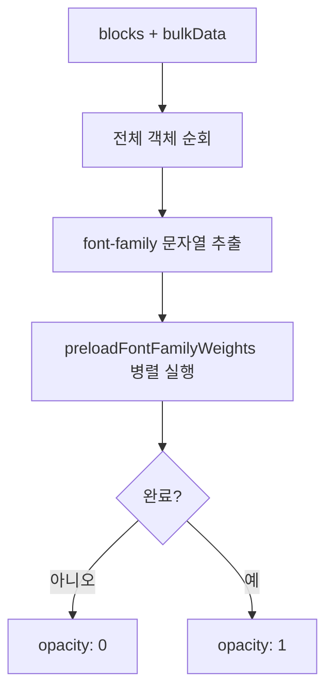
```mermaid
flowchart TD
  A["blocks + bulkData"] --> B["전체 객체 순회"]
  B --> C["font-family 문자열 추출"]
  C --> D["preloadFontFamilyWeights 병렬 실행"]
  D --> E{"완료?"}
  E -- "아니오" --> F["opacity: 0"]
  E -- "예" --> G["opacity: 1"]
```

문제:

- 폰트 로딩이 늦으면 전체 블록 영역이 보이지 않는다.
- 모든 문자열을 재귀 순회하므로 block 수가 늘면 비용이 증가한다.
- 어떤 폰트가 실제 첫 화면에 필요한지 구분하지 않는다.

개선 방향:

1. `data.json` 저장 시 사용 폰트 목록을 함께 저장한다.
2. 게스트 페이지는 저장된 `fontManifest`를 사용한다.
3. 메인 포스터와 첫 번째 블록에 필요한 폰트를 우선 로드한다.
4. 전체 opacity 0 대신 `font-display` 정책과 영역별 fallback을 사용한다.

권장 payload 추가:

```json
{
  "renderHints": {
    "fonts": ["Pretendard", "Gowun Batang"],
    "aboveTheFoldBlockIds": ["block-1", "block-2"],
    "primaryImageFileIds": ["thumbnail-file-id"]
  }
}
```

이 필드는 optional로 시작한다. 기존 저장 데이터와 호환성을 유지하기 위해 없으면 현재 방식으로 fallback한다.

---

## 9. 권장 폴더 구조

리팩토링 후 게스트 페이지 내부 구조를 아래처럼 나누는 것이 좋다.

```txt
app/guest/[id]/
  page.tsx
  server/
    guestDataUrl.ts
    loadGuestPayload.ts
    guestAccessState.ts
  validation/
    parseGuestPayload.ts
    normalizeGuestBlock.ts
    normalizeGuestBulkData.ts
    normalizeGuestBgm.ts
    normalizeGuestMainPoster.ts
  components/
    GuestRenderer.tsx
    GuestMainPoster.tsx
    GuestBgm.tsx
    GuestAccessNotice.tsx
  types/
    guestTypes.ts
```

의존 방향은 아래처럼 유지한다.

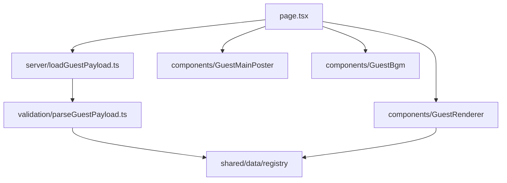
```mermaid
flowchart TD
  A["page.tsx"] --> B["server/loadGuestPayload.ts"]
  B --> C["validation/parseGuestPayload.ts"]
  C --> D["shared/data/registry"]
  A --> E["components/GuestMainPoster"]
  A --> F["components/GuestBgm"]
  A --> G["components/GuestRenderer"]
  G --> D
```

---

## 10. 상세 구현 계획

### 1단계. 문서와 안전장치 정리

목표:

- 현재 동작을 보존한다.
- 깨진 한글 문자열과 문서를 정리한다.
- 리팩토링 전후 비교 기준을 만든다.

작업:

- `GuestAccessNotice`를 `components/GuestAccessNotice.tsx`로 분리한다.
- 깨진 한글 안내 문구를 정상 문구로 복구한다.
- `IMAGE_SOURCE_RENDER_GUIDE.md`의 Drive URL 설명을 실제 구현 기준으로 갱신한다.
- 게스트 페이지 테스트 fixture의 깨진 한글 주석을 정리한다.
- 현재 테스트를 유지한다.

완료 기준:

- 기존 게스트 테스트 통과
- 비공개 Drive 응답 시 하객용 안내 화면 렌더
- JSON parse 실패 시 `notFound()`
- invalid payload 시 `notFound()`

### 2단계. `loadGuestPayload` 도입

목표:

- fetch, private 응답 감지, JSON parse, 검증 로직을 한 곳으로 모은다.
- `generateMetadata`와 `GuestPage`의 중복 fetch 로직을 줄인다.

권장 반환 타입:

```ts
type LoadGuestPayloadResult =
  | {
      status: 'ok';
      payload: NormalizedGuestPayload;
      warnings: GuestPayloadWarning[];
    }
  | { status: 'private' }
  | { status: 'not-found'; reason: string };
```

구현 방향:

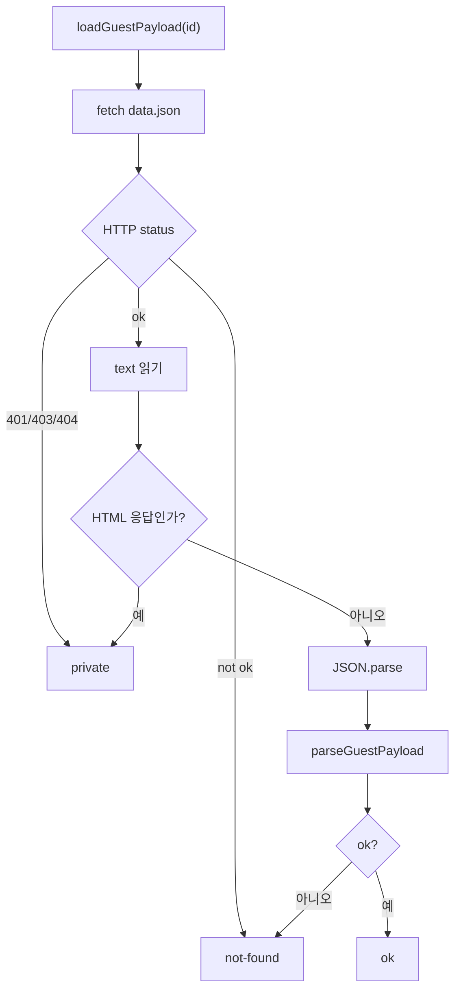
```mermaid
flowchart TD
  A["loadGuestPayload(id)"] --> B["fetch data.json"]
  B --> C{"HTTP status"}
  C -- "401/403/404" --> D["private"]
  C -- "not ok" --> E["not-found"]
  C -- "ok" --> F["text 읽기"]
  F --> G{"HTML 응답인가?"}
  G -- "예" --> D
  G -- "아니오" --> H["JSON.parse"]
  H --> I["parseGuestPayload"]
  I --> J{"ok?"}
  J -- "예" --> K["ok"]
  J -- "아니오" --> E
```

### 3단계. schema 기반 block 정규화

목표:

- 새 컴포넌트 추가 시 타입 가드 수정 부담을 줄인다.
- 잘못된 block 때문에 전체 페이지가 깨지는 문제를 줄인다.

권장 함수:

```ts
export function normalizeGuestBlock(input: unknown): GuestBlockNormalizeResult;
```

권장 정책:

- `id`, `type`, `component`, `props`의 최소 구조는 유지한다.
- `component`가 `blockRegistry`에 없으면 렌더 제외한다.
- `props`가 object가 아니면 렌더 제외한다.
- `fields`의 required 값은 default를 이용해 보정 가능한 경우 보정한다.
- 보정 불가능한 required 누락은 해당 block만 제외한다.
- 알 수 없는 추가 필드는 유지한다.

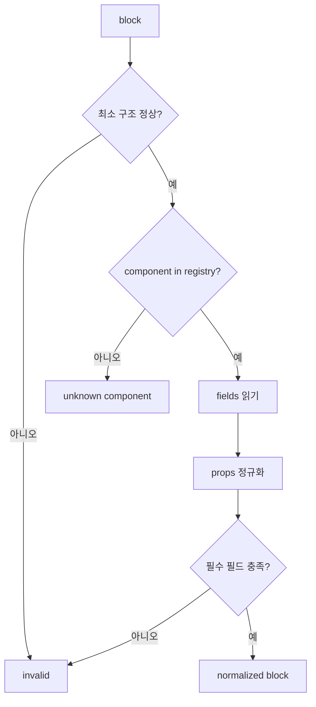
```mermaid
flowchart TD
  A["block"] --> B{"최소 구조 정상?"}
  B -- "아니오" --> X["invalid"]
  B -- "예" --> C{"component in registry?"}
  C -- "아니오" --> Y["unknown component"]
  C -- "예" --> D["fields 읽기"]
  D --> E["props 정규화"]
  E --> F{"필수 필드 충족?"}
  F -- "아니오" --> X
  F -- "예" --> Z["normalized block"]
```

### 4단계. render hints 추가

목표:

- 게스트 렌더 시 전체 객체 순회 비용을 줄인다.
- 메인 포스터와 첫 화면에 필요한 자원을 우선 로드한다.

저장 시점에 추가할 optional 필드:

```ts
type GuestRenderHints = {
  fonts?: string[];
  primaryImageFileIds?: string[];
  aboveTheFoldBlockIds?: string[];
  schemaVersion?: number;
};
```

저장 흐름:

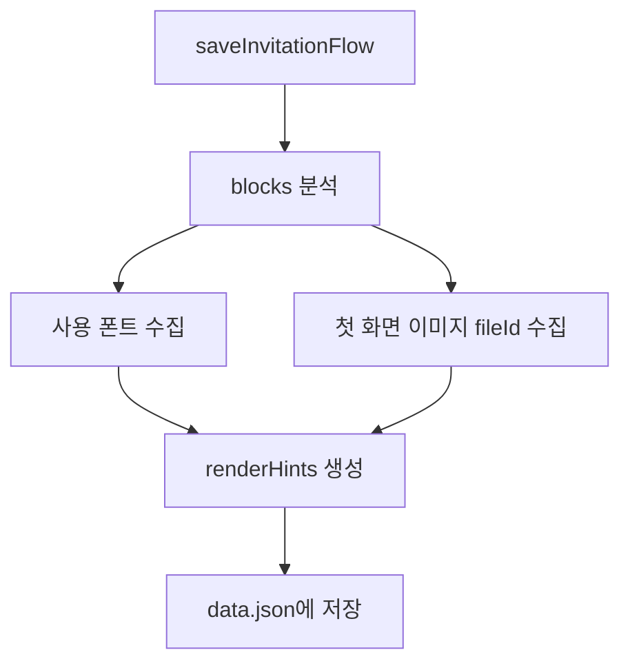
```mermaid
flowchart TD
  A["saveInvitationFlow"] --> B["blocks 분석"]
  B --> C["사용 폰트 수집"]
  B --> D["첫 화면 이미지 fileId 수집"]
  C --> E["renderHints 생성"]
  D --> E
  E --> F["data.json에 저장"]
```

게스트 흐름:

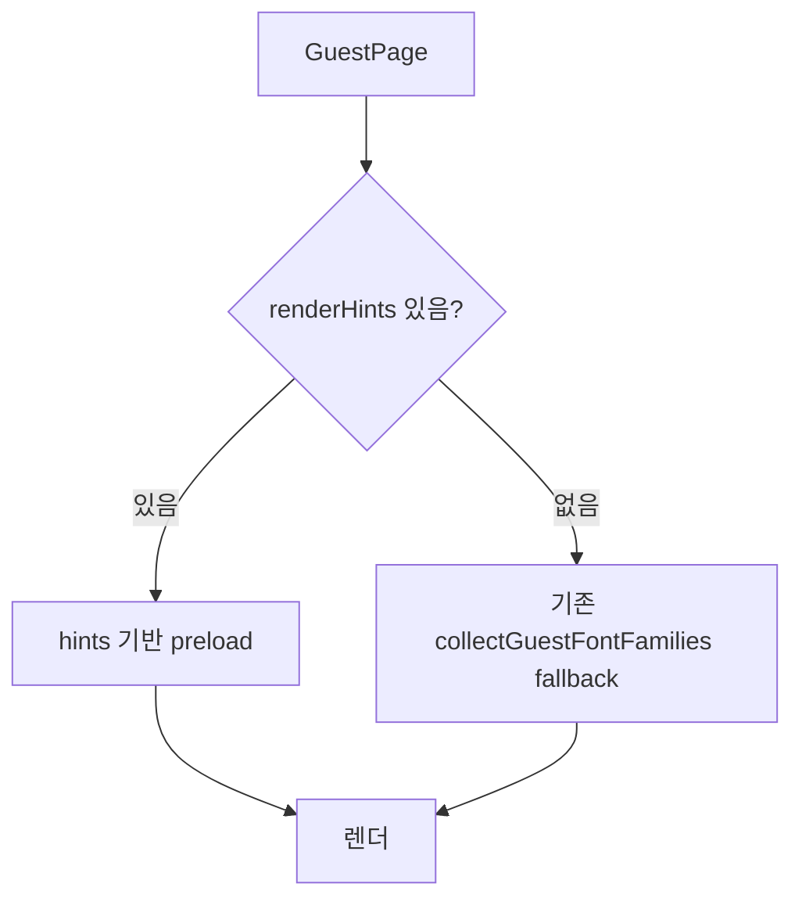
```mermaid
flowchart TD
  A["GuestPage"] --> B{"renderHints 있음?"}
  B -- "있음" --> C["hints 기반 preload"]
  B -- "없음" --> D["기존 collectGuestFontFamilies fallback"]
  C --> E["렌더"]
  D --> E
```

### 5단계. 초기 렌더링 정책 개선

목표:

- 메인 포스터는 가능한 빨리 표시한다.
- 폰트가 늦어도 전체 페이지가 빈 화면처럼 보이지 않게 한다.

작업:

- `GuestMainPoster`에 하객용 fallback UI 적용
- `priority`, `sizes`, `fetchPriority` 검토
- `GuestRenderer`의 전체 opacity 0 전략을 완화
- 첫 화면 블록과 나머지 블록의 로딩 우선순위를 분리

권장 렌더 우선순위:

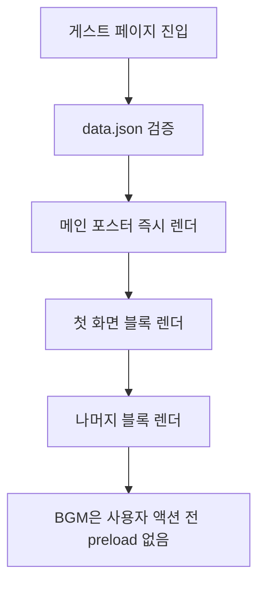
```mermaid
flowchart TD
  A["게스트 페이지 진입"] --> B["data.json 검증"]
  B --> C["메인 포스터 즉시 렌더"]
  C --> D["첫 화면 블록 렌더"]
  D --> E["나머지 블록 렌더"]
  E --> F["BGM은 사용자 액션 전 preload 없음"]
```

---

## 11. 실패 처리 정책

게스트 페이지는 하객이 보는 공개 페이지이므로 실패 화면도 명확해야 한다.

```mermaid
flowchart TD
  A["게스트 페이지 실패"] --> B{"실패 종류"}
  B -- "비공개/권한 없음" --> C["비공개 초대장 안내"]
  B -- "파일 없음" --> D["notFound"]
  B -- "깨진 JSON" --> D
  B -- "payload schema invalid" --> D
  B -- "일부 block invalid" --> E["정상 block만 렌더 + warning 기록"]
  B -- "이미지 실패" --> F["하객용 이미지 fallback"]
  B -- "BGM 실패" --> G["BGM 버튼 비활성 또는 숨김"]
```

권장 원칙:

- 최상위 payload가 깨지면 페이지 전체를 막는다.
- 일부 block만 깨진 경우 전체 초대장을 막지 않고 해당 block만 제외한다.
- 비공개 초대장은 404처럼 보이지 않게 별도 안내한다.
- 하객에게 내부 fileId, stack trace, 디버그 메시지를 노출하지 않는다.

---

## 12. 테스트 계획

현재 통과한 테스트:

```bash
npm test -- --runTestsByPath "app/guest/[id]/guestPage.test.tsx" "app/guest/[id]/utils/guestBlockTypeGuards.test.ts"
```

리팩토링 후 추가할 테스트:

| 테스트                         | 목적                                                |
| ------------------------------ | --------------------------------------------------- |
| `loadGuestPayload` 정상 케이스 | Drive JSON을 정상 payload로 변환                    |
| private Drive HTML 응답        | 비공개 안내 상태 반환                               |
| 깨진 JSON                      | not-found 상태 반환                                 |
| unknown component block        | 전체 실패 없이 warning 후 제외                      |
| required props 누락            | default 보정 가능 여부 확인                         |
| registry 기반 새 컴포넌트      | schema 등록만으로 검증 통과                         |
| 메타데이터 생성                | 같은 loader를 사용해 title/description/image 생성   |
| 이미지 URL 변환                | Drive fileId가 `lh3.googleusercontent.com/d`로 변환 |
| BGM 직접 URL 실패              | proxy fallback 동작                                 |

테스트 구조 제안:

```txt
app/guest/[id]/
  server/
    loadGuestPayload.test.ts
  validation/
    parseGuestPayload.test.ts
    normalizeGuestBlock.test.ts
  components/
    GuestMainPoster.test.tsx
```

---

## 13. 마이그레이션 전략

기존 저장 데이터가 이미 존재할 수 있으므로, 리팩토링은 하위 호환을 전제로 해야 한다.

```mermaid
flowchart TD
  A["기존 data.json"] --> B{"renderHints 있음?"}
  B -- "없음" --> C["기존 방식 fallback"]
  B -- "있음" --> D["신규 최적화 경로"]
  C --> E["정상 렌더"]
  D --> E
```

권장 순서:

1. 기존 `isGuestPayload` 유지
2. 새 `parseGuestPayload` 추가
3. `isGuestPayload`가 새 parser를 감싸도록 변경
4. `page.tsx`에서 `loadGuestPayload` 사용
5. 저장 payload에 optional `renderHints` 추가
6. 충분히 안정화 후 구형 fallback 정리 검토

---

## 14. 최종 목표 구조

리팩토링 완료 후 기대하는 구조는 아래와 같다.

```mermaid
flowchart TD
  A["/guest/{dataJsonFileId}"] --> B["loadGuestPayload"]
  B --> C["fetch Drive data.json"]
  C --> D["parseGuestPayload"]
  D --> E["envelope strict validation"]
  D --> F["block registry validation"]
  F --> G["normalized payload"]
  G --> H["metadata 생성"]
  G --> I["GuestPage 렌더"]
  I --> J["GuestMainPoster"]
  I --> K["GuestRenderer"]
  I --> L["GuestBgm"]
  K --> M["validated blocks only"]
```

기대 효과:

- 잘못된 최상위 payload는 확실히 차단한다.
- 일부 block 오류는 전체 초대장 장애로 확산되지 않는다.
- 새 컴포넌트 추가 시 타입 가드 수정 부담이 줄어든다.
- 이미지 로딩은 현재처럼 Google 공개 URL 직접 접근을 유지한다.
- 첫 화면 자원 우선순위를 명확히 해 하객 체감 로딩 속도를 개선한다.

---

## 15. 우선순위 제안

1. `GuestAccessNotice` 분리 및 깨진 한글 문구 정리
2. `loadGuestPayload` 도입으로 fetch/parse/검증 책임 통합
3. `parseGuestPayload` 결과 타입 도입
4. `blockRegistry` 기반 block 정규화
5. `GuestRenderer`가 정규화된 block을 받도록 변경
6. `renderHints` optional 도입
7. 폰트 preload와 메인 포스터 우선 로딩 개선
8. 문서와 테스트 보강

가장 먼저 해야 할 일은 2번과 3번이다. 이 두 작업이 들어가면 이후 최적화와 타입 가드 개선이 모두 같은 진입점을 기준으로 진행될 수 있다.
