# 게스트 페이지 리팩토링 결과 보고서

## 1. 요약

게스트 페이지 리팩토링은 다음 목표를 기준으로 진행했다.

- 하객이 초대장 링크에 접속했을 때 더 빠르고 안정적으로 첫 화면을 볼 수 있게 한다.
- Google Drive 공개 URL 기반 이미지 로딩을 유지해 Vercel 이미지 최적화/CDN 비용 사용을 늘리지 않는다.
- 잘못된 `data.json`, 비공개 Drive 응답, 깨진 block 데이터가 이상한 화면으로 이어지지 않게 한다.
- 새 컴포넌트가 추가될 때마다 게스트 타입 가드를 수동으로 고치는 부담을 줄인다.
- 기존 초대장 데이터와 호환되도록 optional/fallback 구조를 유지한다.

이번 작업으로 게스트 페이지는 `fetch -> parse -> normalize -> render` 흐름이 명확해졌고, `renderHints` 기반 최적화 경로가 추가되었다.

---

## 2. 전체 진행 결과

| 순서 | 작업 항목                                      | 상태 | 핵심 결과                                     |
| ---- | ---------------------------------------------- | ---- | --------------------------------------------- |
| 1    | `GuestAccessNotice` 분리 및 한글 문구 정리     | 완료 | 비공개 초대장 안내 UI 분리                    |
| 2    | `loadGuestPayload` 도입                        | 완료 | fetch/HTML 감지/JSON parse/검증 책임 통합     |
| 3    | `parseGuestPayload` 결과 타입 도입             | 완료 | 성공/실패/warning을 표현하는 parser 추가      |
| 4    | `blockSchema` 기반 block 정규화                | 완료 | 알 수 없는 block은 제외, props는 default 보정 |
| 5    | `GuestRenderer`가 정규화된 block을 받도록 변경 | 완료 | renderer 입력 계약을 `NormalizedPayload` 기준 |
| 6    | `renderHints` optional 도입                    | 완료 | 저장 시 font/image/above-fold 힌트 생성       |
| 7    | 폰트 preload와 메인 포스터 우선 로딩 개선      | 완료 | hints 우선 폰트 preload, poster priority 적용 |
| 8    | 문서와 테스트 보강                             | 완료 | 결과 보고서와 신규 테스트 추가                |

---

## 3. Before / After

### Before

이전 구조는 `page.tsx`가 많은 책임을 직접 갖고 있었다.

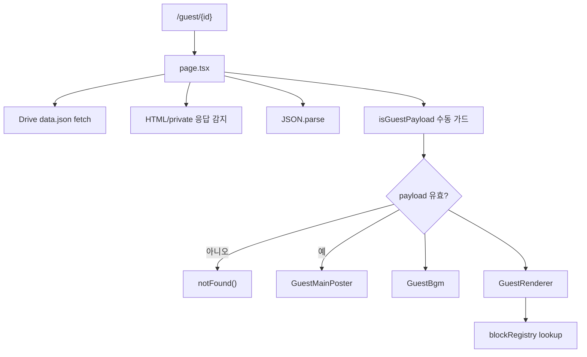

문제점:

- `generateMetadata`와 `GuestPage`가 비슷한 fetch/parse 로직을 각각 갖고 있었다.
- `isGuestPayload`가 수동 최상위 검증에 머물러 있었다.
- block별 props 보정이 없어 새 컴포넌트 확장성과 런타임 안정성 사이 균형이 약했다.
- `GuestRenderer`가 폰트 계산을 위해 매번 전체 blocks를 훑었다.
- 메인 포스터 fallback UI가 하객에게 내부 디버그 정보를 보여줄 수 있었다.

### After

리팩토링 후에는 책임이 분리되었다.

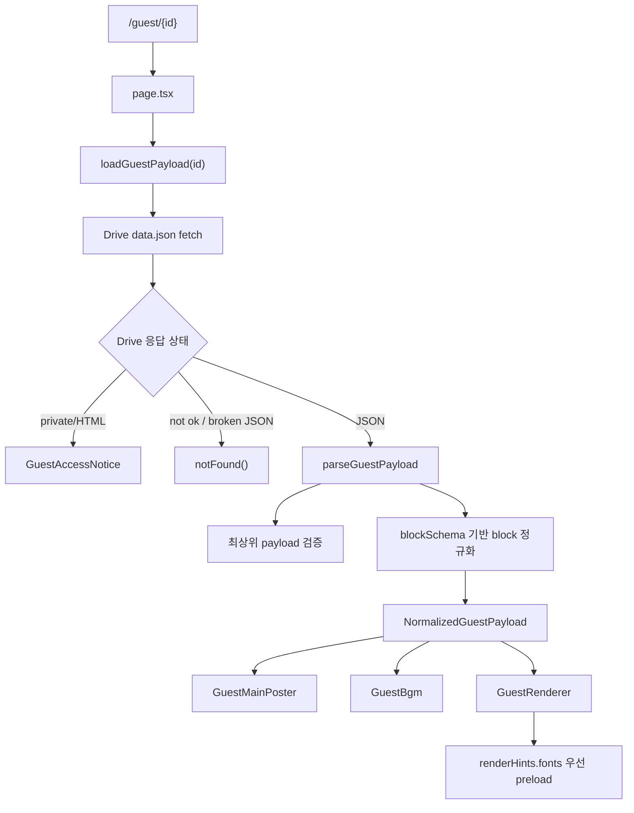

개선점:

- fetch/parse/검증 책임이 `loadGuestPayload`로 통합되었다.
- `parseGuestPayload`가 최상위 실패와 block 단위 warning을 구분한다.
- `blockSchema` 기준으로 props default를 주입한다.
- 기존 `isGuestPayload`는 parser wrapper로 유지되어 호환성이 남아 있다.
- `renderHints`가 있으면 폰트 탐색 비용을 줄인다.
- 메인 포스터는 우선 로딩 속성을 갖고, fallback은 하객용 문구로 바뀌었다.

---

## 4. 새 게스트 데이터 흐름

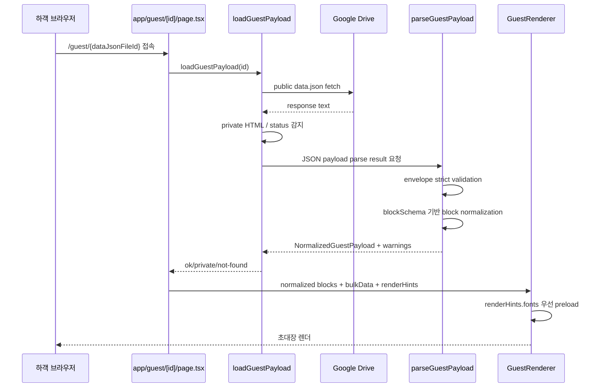

---

## 5. 저장 시점 renderHints 흐름

`renderHints`는 저장 시점에 계산해 `data.json`에 같이 저장하는 optional 힌트다. 기존 초대장처럼 이 필드가 없어도 게스트 페이지는 fallback으로 동작한다.

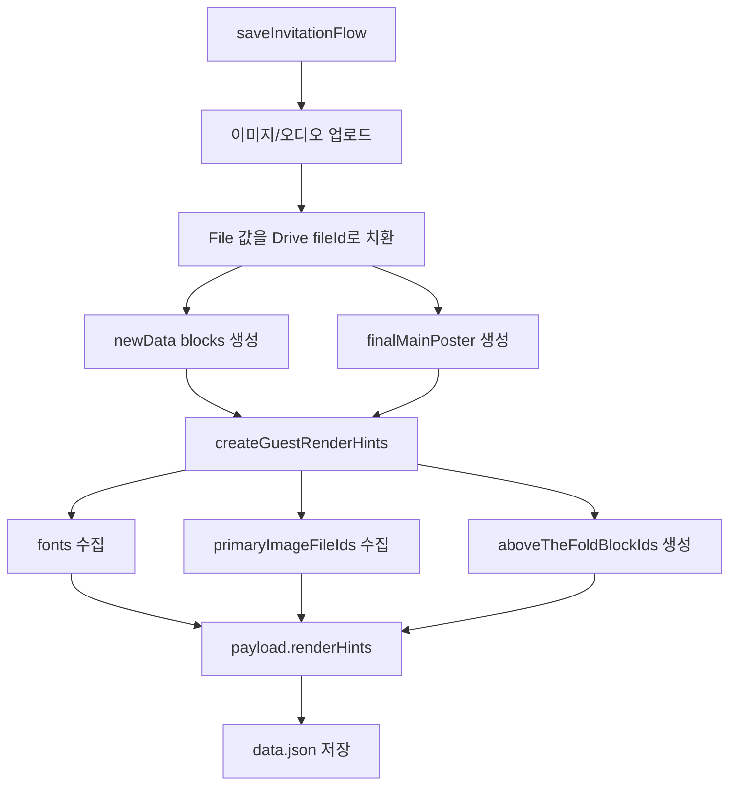

`renderHints` 예시:

```json
{
  "renderHints": {
    "schemaVersion": 1,
    "fonts": ["LINESeedKR", "Pretendard"],
    "primaryImageFileIds": [
      "poster-thumbnail-file-id",
      "gallery-image-file-id"
    ],
    "aboveTheFoldBlockIds": ["block-1", "block-2"]
  }
}
```

필드 의미:

| 필드                   | 의미                                  | 현재 사용 여부                 |
| ---------------------- | ------------------------------------- | ------------------------------ |
| `schemaVersion`        | 힌트 구조 버전                        | parser 정규화에 사용           |
| `fonts`                | 게스트 렌더에 필요한 폰트 family 목록 | `GuestRenderer` preload에 사용 |
| `primaryImageFileIds`  | 중요 이미지 후보                      | 다음 preload 확장 재료         |
| `aboveTheFoldBlockIds` | 상단 우선 block 후보                  | 다음 렌더 우선순위 재료        |

---

## 6. Parser와 Block 정규화 정책

최상위 payload는 엄격하게 막고, block 단위 오류는 전체 초대장 실패로 번지지 않게 했다.

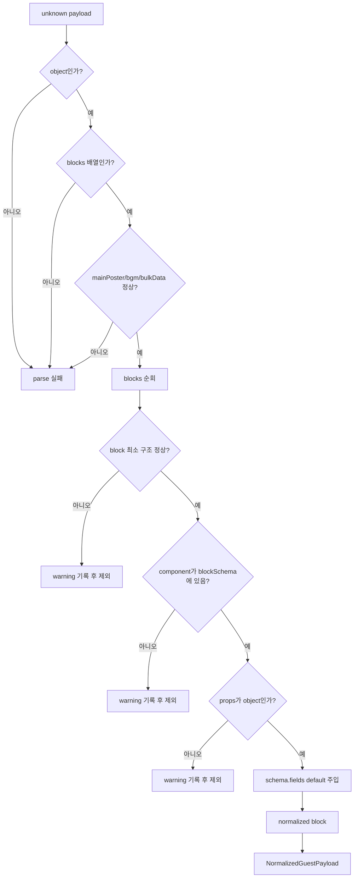

정책 정리:

| 상황                      | 처리                          |
| ------------------------- | ----------------------------- |
| payload 자체가 객체 아님  | 전체 실패                     |
| `blocks`가 배열 아님      | 전체 실패                     |
| `mainPoster` 구조 오류    | 전체 실패                     |
| `bgm` 구조 오류           | 전체 실패                     |
| `bulkData` 구조 오류      | 전체 실패                     |
| 알 수 없는 component      | 해당 block 제외, warning 기록 |
| block props가 object 아님 | 해당 block 제외, warning 기록 |
| 누락된 schema field       | default 주입                  |
| 기존 `renderHints` 없음   | 정상 허용, fallback 경로 사용 |

---

## 7. 폰트 preload 개선

기존에는 `GuestRenderer`가 매번 전체 block 객체를 훑어 폰트를 찾았다.

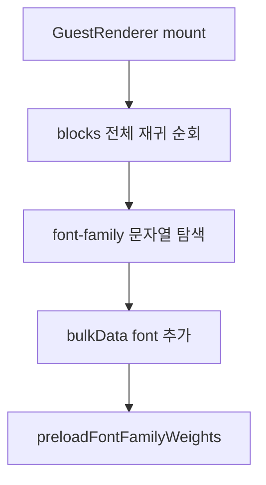

현재는 `renderHints.fonts`가 있으면 먼저 사용한다.

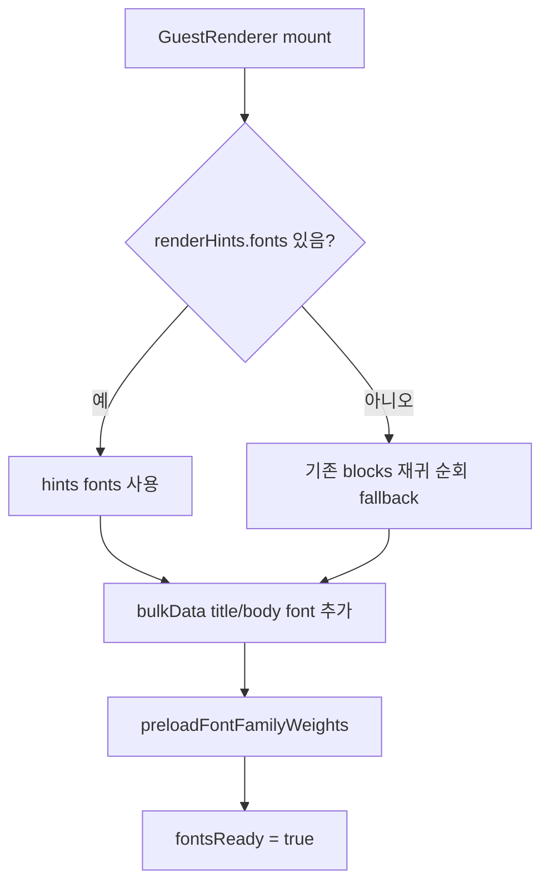

장점:

- 새로 저장된 초대장은 전체 block 순회 비용을 줄일 수 있다.
- 기존 초대장은 hints가 없으므로 기존 방식으로 동작한다.
- `renderHints`가 잘못되거나 비어 있어도 fallback 경로가 남아 있다.

---

## 8. 메인 포스터 우선 로딩 개선

메인 포스터는 하객이 가장 먼저 보는 이미지다. 이번 작업에서는 Google Drive 직접 URL 정책을 유지하면서 브라우저 요청 우선순위를 높였다.

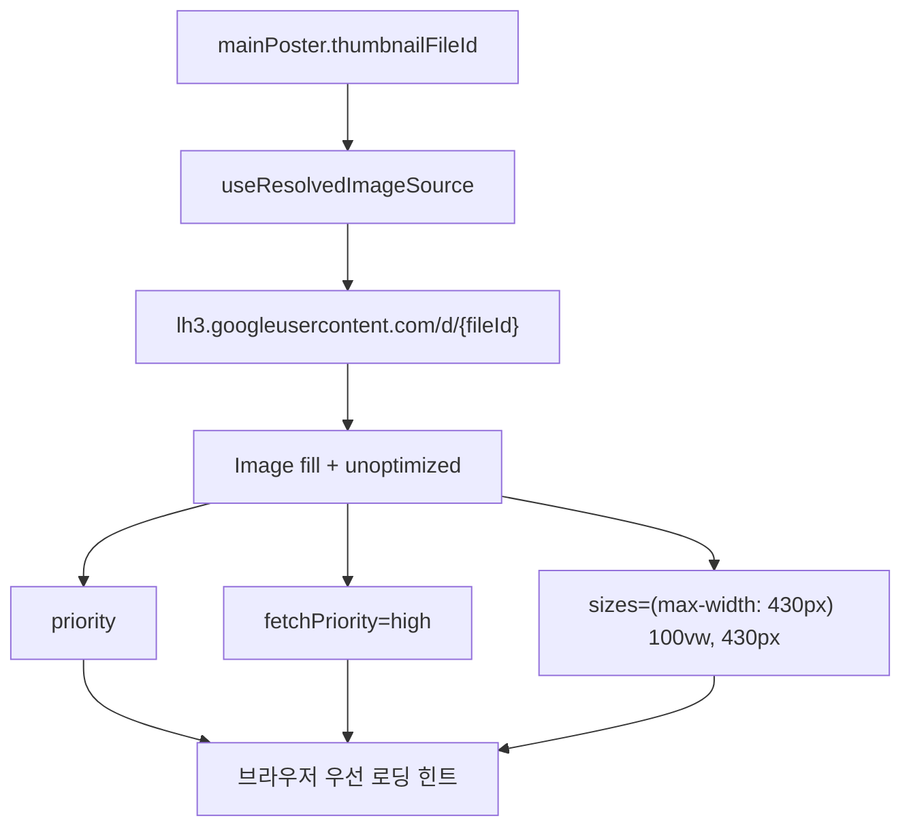

중요한 점:

- `unoptimized`는 유지했다. Vercel 이미지 최적화 파이프라인을 타지 않기 위해서다.
- `priority`, `fetchPriority`, `sizes`를 추가했다.
- 포스터 이미지가 없을 때 내부 `thumbnailFileId`를 노출하지 않고 하객용 fallback 문구를 보여준다.

포스터 브라우저 캐싱에 대한 판단:

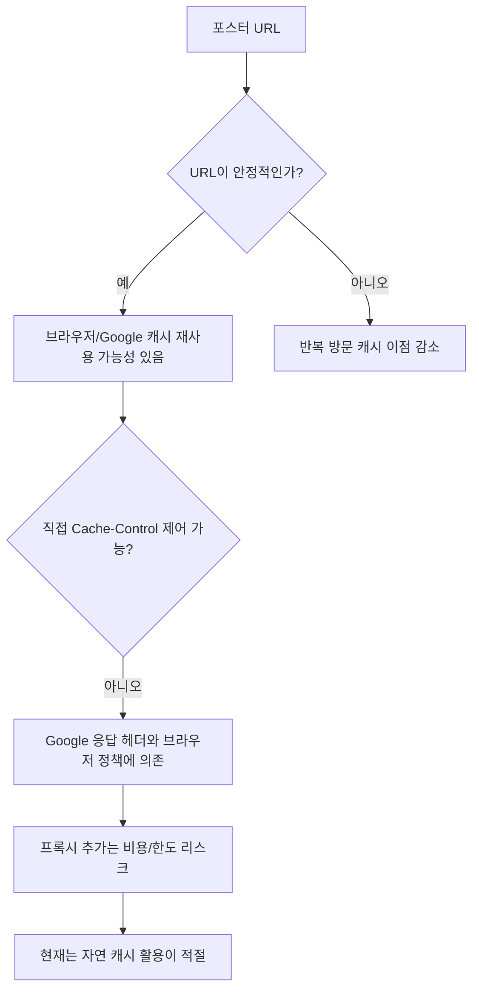

결론:

- 별도 서버 프록시나 Service Worker 캐시를 지금 넣는 것은 비용/복잡도 대비 이득이 불확실하다.
- 현재처럼 URL을 안정적으로 유지하고, 브라우저 기본 캐시를 방해하지 않는 방향이 적절하다.

---

## 9. 파일별 변경 요약

### 게스트 페이지 진입부

| 파일                                        | 변경                                                                  |
| ------------------------------------------- | --------------------------------------------------------------------- |
| `app/guest/[id]/page.tsx`                   | `loadGuestPayload` 사용, `GuestAccessNotice` 분리, `renderHints` 전달 |
| `app/guest/[id]/server/guestDataUrl.ts`     | Drive public data URL 생성 함수 분리                                  |
| `app/guest/[id]/server/loadGuestPayload.ts` | fetch/HTML 감지/JSON parse/parser 호출 통합                           |

### 검증/정규화

| 파일                                               | 변경                                                       |
| -------------------------------------------------- | ---------------------------------------------------------- |
| `app/guest/[id]/validation/parseGuestPayload.ts`   | 결과 타입, 최상위 검증, block 정규화, `renderHints` 정규화 |
| `app/guest/[id]/validation/normalizeGuestBlock.ts` | `blockSchema` 기반 component 확인 및 props default 주입    |
| `app/guest/[id]/utils/guestBlockTypeGuards.ts`     | 기존 수동 가드를 parser wrapper로 전환                     |

### 렌더링 최적화

| 파일                                              | 변경                                             |
| ------------------------------------------------- | ------------------------------------------------ |
| `app/guest/[id]/components/GuestRenderer.tsx`     | 정규화 payload 타입 사용, `renderHints` 전달받음 |
| `app/guest/[id]/components/guestFontPreload.ts`   | hints 우선 폰트 preload 후보 계산                |
| `app/guest/[id]/components/GuestMainPoster.tsx`   | poster 우선 로딩 속성 추가, 하객용 fallback 적용 |
| `app/guest/[id]/components/GuestAccessNotice.tsx` | 비공개 초대장 안내 UI 분리                       |

### 저장 흐름

| 파일                                                 | 변경                                          |
| ---------------------------------------------------- | --------------------------------------------- |
| `features/invitation/save/createGuestRenderHints.ts` | 저장 시점 render hints 생성                   |
| `features/invitation/save/saveInvitationFlow.ts`     | 최종 `data.json` payload에 `renderHints` 포함 |
| `shared/types/renderHints.ts`                        | 공용 `GuestRenderHints` 타입 추가             |
| `shared/types/invitationSave.ts`                     | 저장 payload 타입에 `renderHints` 추가        |
| `app/guest/[id]/types/guestTypes.ts`                 | 게스트 payload 타입에 `renderHints` 추가      |

### 공유 준비 검증

| 파일                                   | 변경                                                    |
| -------------------------------------- | ------------------------------------------------------- |
| `app/api/drive/_lib/guestReadiness.ts` | `isGuestPayload` 대신 `parseGuestPayload` 기준으로 검증 |

---

## 10. 테스트 보강 결과

추가/갱신한 테스트:

| 테스트 파일                      | 검증 내용                                             |
| -------------------------------- | ----------------------------------------------------- |
| `loadGuestPayload.test.ts`       | 공개/비공개/HTML/깨진 JSON/invalid payload 분기       |
| `parseGuestPayload.test.ts`      | parser 성공/실패, block warning, `renderHints` 정규화 |
| `normalizeGuestBlock.test.ts`    | blockSchema 기반 default 주입, unknown component 제외 |
| `guestFontPreload.test.ts`       | `renderHints.fonts` 우선 사용, fallback scan          |
| `createGuestRenderHints.test.ts` | 저장 시점 font/image/above-fold 힌트 생성             |
| `guestPage.test.tsx`             | 정규화 block 전달, `renderHints` 전달, 기존 분기 유지 |
| `guestBlockTypeGuards.test.ts`   | parser wrapper로 전환된 `isGuestPayload` 계약         |

검증 명령:

```bash
npm test -- --runTestsByPath "app/guest/[id]/guestPage.test.tsx" "app/guest/[id]/components/guestFontPreload.test.ts" "app/guest/[id]/utils/guestBlockTypeGuards.test.ts" "app/guest/[id]/server/loadGuestPayload.test.ts" "app/guest/[id]/validation/normalizeGuestBlock.test.ts" "app/guest/[id]/validation/parseGuestPayload.test.ts" "features/invitation/save/createGuestRenderHints.test.ts"
```

결과:

```txt
Test Suites: 7 passed, 7 total
Tests: 35 passed, 35 total
```

변경 파일 ESLint도 통과했다.

---

## 11. 남은 리스크와 권장 후속 작업

### 11.1 TypeScript asset module declaration

`npx tsc --noEmit`을 실행하면 정적 이미지/SVG import 타입 선언 문제가 남아 있다.

현재 확인된 대표 오류:

```txt
app/guest/[id]/components/GuestAccessNotice.tsx
Cannot find module '@/shared/assets/logo/invia-simple-logo-3d.png'
```

이 문제는 이번 리팩토링에서 새로 만든 로직 오류라기보다, 프로젝트 전역의 정적 asset module declaration 문제다. 같은 계열의 오류가 다른 PNG/SVG import에서도 다수 발생한다.

권장 해결:

```ts
declare module '*.png';
declare module '*.svg';
declare module '*.webp';
```

단, SVG는 SVGR 컴포넌트 import와 URL import 정책이 섞일 수 있으므로 기존 webpack/turbopack 설정과 맞춰 선언해야 한다.

### 11.2 `renderHints.primaryImageFileIds` 미사용

현재 `primaryImageFileIds`는 저장하고 parser에서 읽지만, 실제 `<link rel="preload" as="image">` 생성에는 아직 쓰지 않는다.

이유:

- Google 공개 URL 직접 사용 정책과 브라우저/Drive 캐시 정책을 더 확인해야 한다.
- 무조건 preload하면 네트워크 경쟁이 커질 수 있다.
- 메인 포스터는 이미 `priority`, `fetchPriority`, `sizes`로 우선순위 힌트를 주고 있다.

후속 검토:

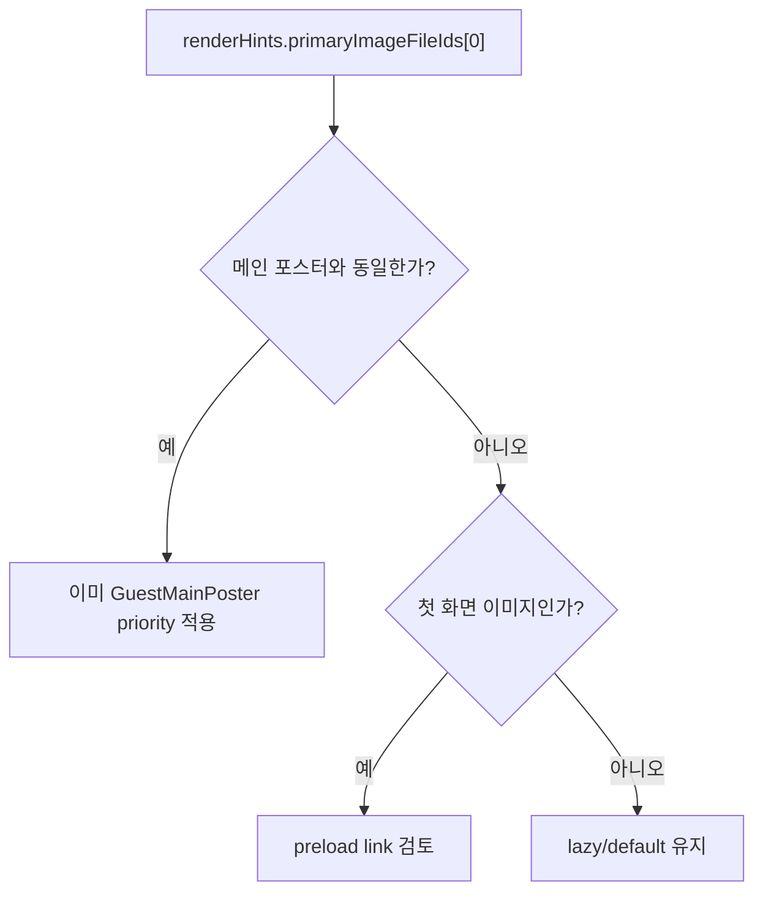

### 11.3 전체 opacity 0 전략

현재 `GuestRenderer`는 폰트 preload가 끝나기 전까지 block 영역 opacity를 0으로 둔다. 이번 작업에서는 preload 후보 계산을 개선했지만, opacity 정책 자체는 유지했다.

후속 개선 방향:

- 전체 block 숨김 대신 첫 화면 block만 제한적으로 처리
- skeleton/fallback font-display 전략 검토
- 폰트 로딩 실패 시에도 일정 시간 후 표시하는 timeout 정책 검토

---

## 12. 최종 구조 다이어그램

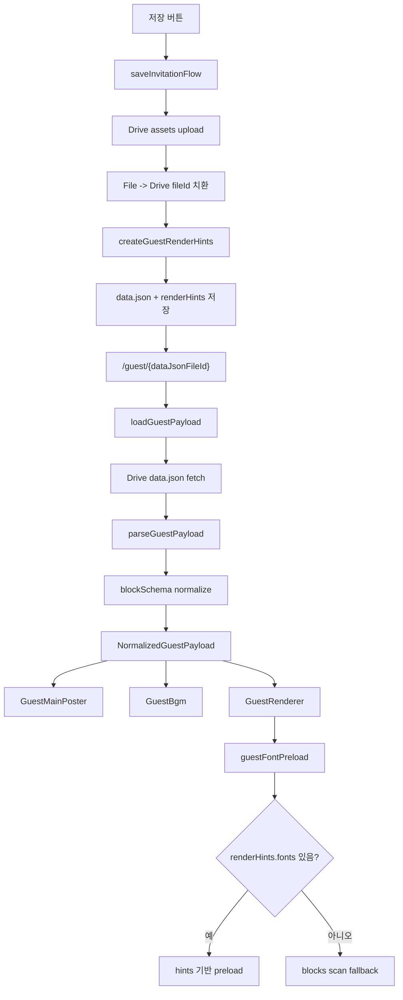

---

## 13. 결론

이번 리팩토링으로 게스트 페이지는 다음 상태가 되었다.

- 공개 Drive `data.json` 로딩 책임이 서버 loader로 모였다.
- 최상위 payload는 엄격하게 검증하고, block 단위 오류는 warning/제외 처리한다.
- `blockSchema` 기반 default 보정으로 새 컴포넌트 확장성이 좋아졌다.
- 기존 `isGuestPayload`는 parser wrapper로 남아 호출부 호환성을 유지한다.
- `renderHints`가 저장되어 게스트 렌더링 최적화의 기반이 생겼다.
- `GuestRenderer`는 hints 기반 폰트 preload를 우선 사용한다.
- 메인 포스터는 Google 공개 URL 직접 사용 정책을 유지하면서 우선 로딩 힌트를 받는다.
- 하객에게 내부 fileId/debug UI가 노출되지 않도록 fallback UI가 정리되었다.

현재 남은 주요 작업은 리팩토링 자체보다 프로젝트 전역의 asset module declaration 정리와, 필요 시 `primaryImageFileIds` 기반 이미지 preload를 실제로 도입할지 판단하는 것이다.
