# 에디터 저장 플로우 및 대시보드 공개 관리 리팩토링 결과 보고서

> 작성일: 2026-06-11  
> 기준: 현재 작업 트리의 `git diff HEAD` 및 untracked `app/api/drive/guestReadiness/` 확인 기준  
> 목적: 에디터의 발행 역할 제거, 대시보드 중심의 공개/비공개/공유/URL 관리 구조로 전환된 내용을 코드 기준으로 설명한다.

---

## 1. 결론

이번 리팩토링의 핵심 변화는 **에디터는 저장만 담당하고, 공개/비공개/공유/URL/readiness 관리는 대시보드가 담당하도록 책임을 분리한 것**이다.

과거에는 저장 성공 후 에디터 또는 대시보드의 "발행" 버튼이 공개 권한 부여, URL 생성, readiness 확인을 한 번에 수행했다. 현재는 저장 과정에서 기본 공개 권한을 먼저 붙이고, 대시보드는 `meta.json`과 pending handoff를 기반으로 방금 만든 초대장을 안정적으로 흡수한다. 이후 사용자가 공개/비공개 토글을 조작하면 `invitationVisibility` API가 Drive 권한과 `meta.published`를 갱신한다.

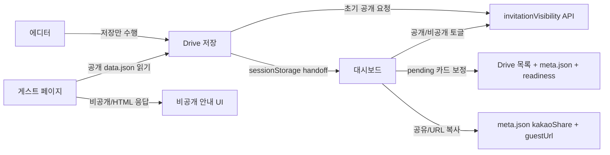

---

## 2. Diff 기준 변경 규모

현재 `git diff HEAD --stat` 기준으로는 다음 규모의 변경이 있다.

```txt
31 files changed, 2418 insertions(+), 591 deletions(-)
```

추가로 `git diff HEAD`에는 잡히지 않는 untracked 경로가 있다.

```txt
app/api/drive/guestReadiness/
docs/editor-dashboard-save-refactor-progress-report.md
```

이번 보고서 파일도 새로 추가된다.

---

## 3. Before / After

### 3.1 책임 분리

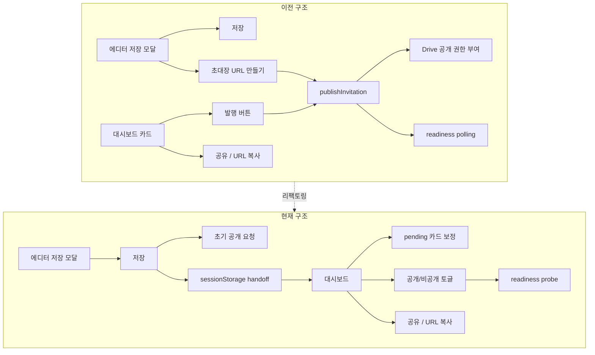

### 3.2 발행 개념의 분해

과거의 "발행"은 여러 책임이 섞인 사용자 액션이었다.

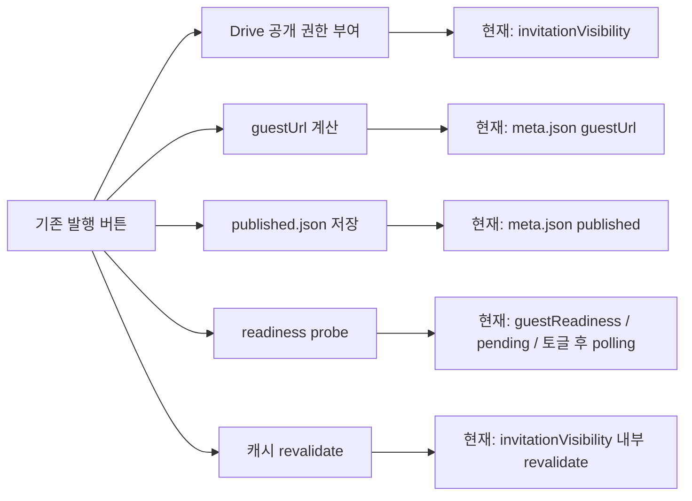

---

## 4. 핵심 데이터 모델 변화

### 4.1 `published.json` 제거 방향과 `meta.json` 도입

기존에는 공개 상태와 공유 메타데이터가 여러 파일로 나뉘어 있었다.

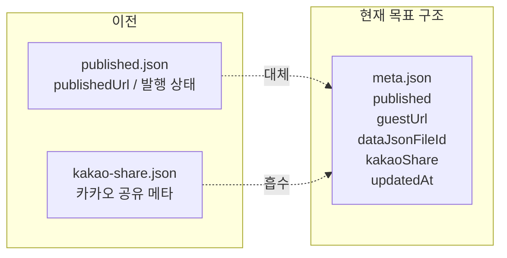

새 helper는 다음 파일에 있다.

```txt
app/api/drive/_lib/ensureInvitationMetaFile.ts
```

주요 역할:

- `meta.json` 검색
- 없으면 생성
- 있으면 업데이트
- 기존 payload를 안전하게 normalize
- `published`, `guestUrl`, `dataJsonFileId`, `kakaoShare`를 한 곳에서 관리

### 4.2 현재 카드 데이터 계약

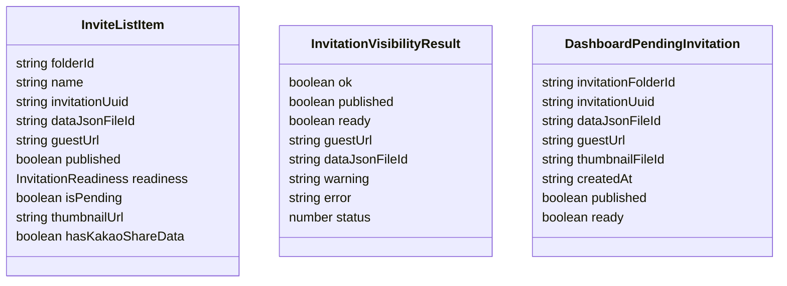

---

## 5. 에디터 저장 플로우 변화

### 5.1 이전 저장 플로우

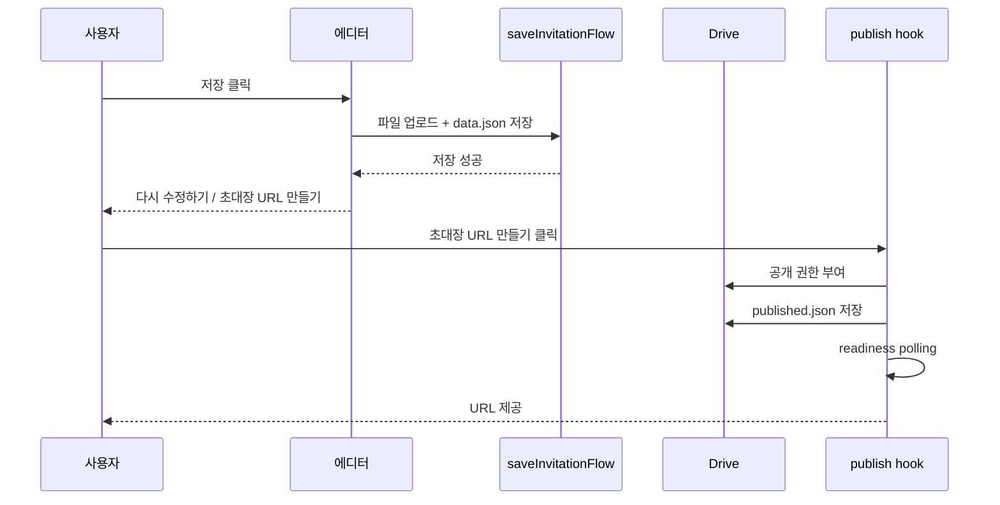

### 5.2 현재 저장 플로우

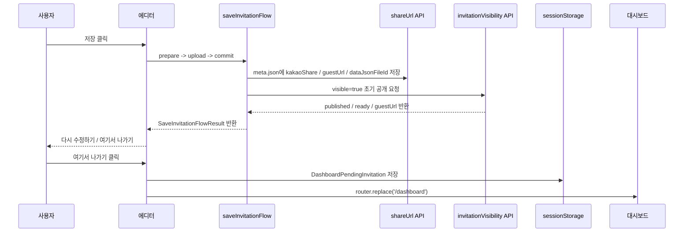

변경된 코드 위치:

```txt
features/invitation/save/saveInvitationFlow.ts
widgets/editor/preview/hooks/useInvitationUpload.ts
widgets/editor/preview/components/SaveModal.tsx
shared/constants/dashboardPendingInvitation.ts
```

중요한 정책:

- `meta.json` 저장 실패는 전체 저장 실패로 본다.
- 저장 필수 단계가 성공한 경우에만 초기 공개 요청을 수행한다.
- 초기 공개 권한 요청 실패는 저장 실패로 본다.
- 초기 공개 요청은 성공했지만 readiness가 아직 false인 경우는 저장 성공으로 보고 대시보드 pending에서 이어서 확인한다.
- "여기서 나가기"는 `router.replace('/dashboard')`로 이동하여 뒤로가기로 저장 직후 모달로 돌아가지 않게 한다.

---

## 6. 대시보드 pending / readiness 구조

### 6.1 Pending과 readiness의 분리

이번 리팩토링에서 가장 중요한 상태 분리는 다음이다.

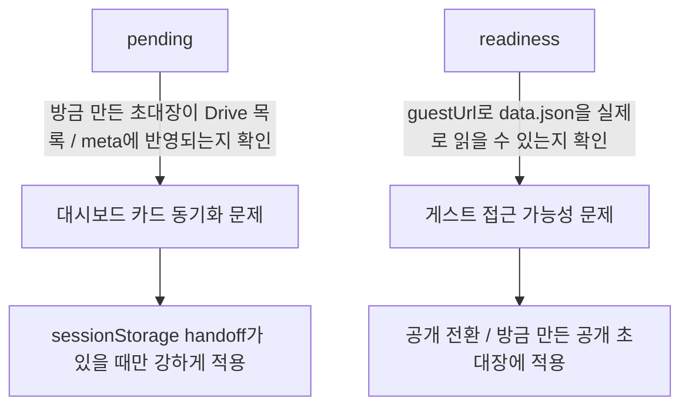

### 6.2 방금 만든 초대장의 pending 완료 조건

현재 pending 카드는 다음 조건을 만족해야 완료된다.

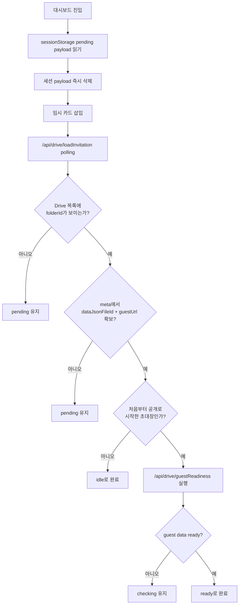

코드 위치:

```txt
app/dashboard/hooks/useDashboardInvitations.ts
```

관련 상수:

```txt
READINESS_POLL_DELAYS_MS = [1000, 1500, 2500, 4000, 6000]
PENDING_INVITATION_POLL_DELAYS_MS = [1000, 1500, 2500, 4000, 6000]
PENDING_INVITATION_MAX_ATTEMPTS = 10
```

무한 pending 방지:

- 최대 10회까지만 pending polling을 수행한다.
- 끝까지 완료되지 않으면 `readiness: 'failed'`, `isPending: false`로 전환한다.
- 실패 정보는 `warning: 'pending_sync_timeout'`으로 `invitationResults`에 남긴다.

### 6.3 일반 과거 초대장의 readiness

과거 초대장은 dashboard mount 때 전부 readiness probe를 돌리지 않는다.

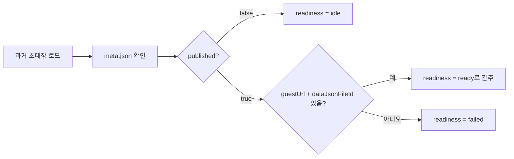

이 정책은 과거 발행 구조와 비슷하다. 예전에도 오래된 초대장 전체를 백그라운드 probe하지 않고, 사용자가 발행/재발행 액션을 했을 때 readiness를 확인했다. 현재는 그 시점이 "공개 토글"로 이동했다.

---

## 7. 공개/비공개 토글 구조

### 7.1 새 API

```txt
POST /api/drive/invitationVisibility
```

요청:

```ts
{
  invitationFolderId: string;
  visible: boolean;
}
```

응답:

```ts
{
  ok: boolean;
  published?: boolean;
  ready?: boolean;
  guestUrl?: string;
  dataJsonFileId?: string;
  warning?: string;
  error?: string;
  status?: number;
}
```

코드 위치:

```txt
app/api/drive/invitationVisibility/route.ts
app/api/drive/_lib/publishPermissionWithRetry.ts
app/api/drive/_lib/revokePublicPermissionWithRetry.ts
app/api/drive/_lib/guestReadiness.ts
```

### 7.2 공개 전환

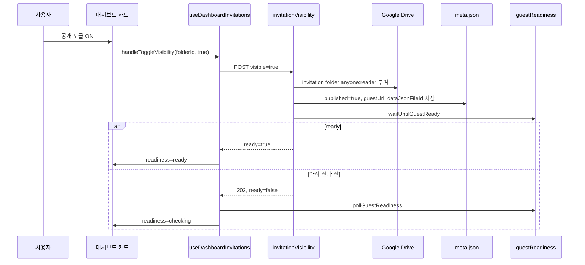

### 7.3 비공개 전환

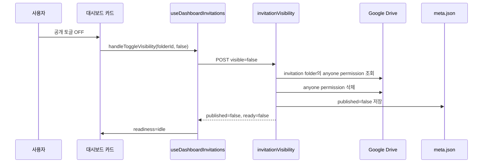

중요한 Drive 권한 정책:

- 공개 권한은 초대장 루트 폴더에 부여한다.
- 하위 `data.json`, 이미지, 오디오, 썸네일은 폴더 권한 상속을 기대한다.
- 비공개 전환은 초대장 루트 폴더의 `anyone` permission을 삭제한다.
- 현재 구현은 하위 파일의 개별 public permission을 따로 순회 삭제하지 않는다.

---

## 8. 공유 / URL 복사 정책 변화

공유와 URL 복사는 공개 상태와 독립적으로 동작하도록 변경되었다.

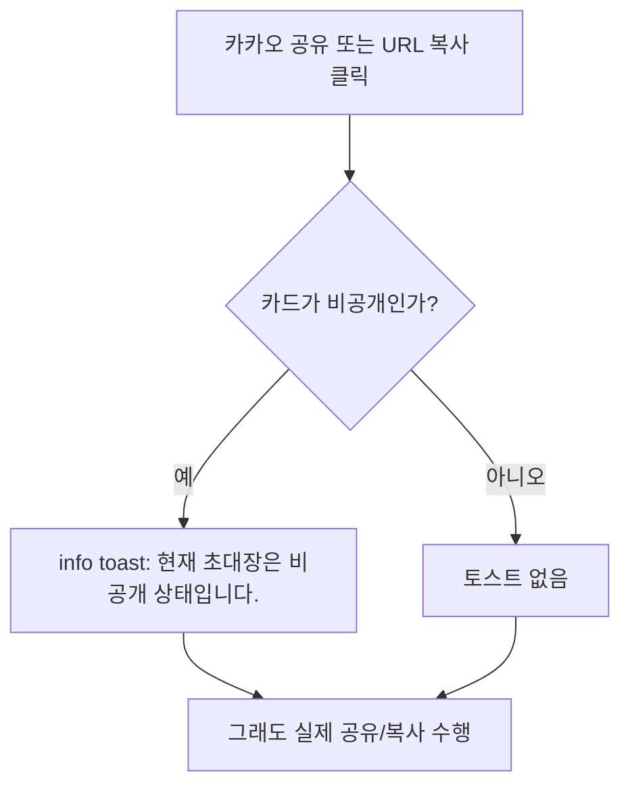

코드 위치:

```txt
app/dashboard/hooks/useDashboardInvitations.ts
app/dashboard/components/carousel/item/CarouselItem.tsx
app/dashboard/components/carousel/item/actions/DashboardActionButton.tsx
```

변경 내용:

- 비공개 상태에서도 카카오 공유 버튼과 URL 복사 버튼을 막지 않는다.
- 비공개 상태에서 누르면 info toast만 먼저 띄운다.
- 이후 실제 카카오 공유 또는 클립보드 복사는 그대로 실행한다.
- 카카오 공유 버튼 클릭 시 투명해지는 disabled/active 계열 시각 변화는 제거하고 hover 중심으로 정리했다.

---

## 9. 대시보드 이미지 로딩 개선

초기 캐러셀에서 썸네일이 늦게 뜨거나 깨져 보이는 문제를 줄이기 위해 초기 카드 이미지 preload가 추가되었다.

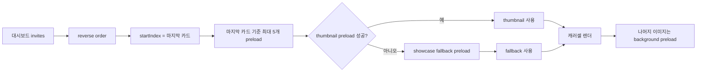

코드 위치:

```txt
app/dashboard/components/carousel/CarouselWrapper.tsx
app/dashboard/components/carousel/carouselTypes.ts
app/dashboard/components/carousel/item/CarouselItem.tsx
```

정책:

- 초기 화면에 가까운 카드 5개를 먼저 preload한다.
- 초기 5개가 준비되기 전에는 skeleton을 유지한다.
- 썸네일이 실패하면 showcase fallback 이미지를 사용한다.
- 나머지 카드는 초기 렌더 후 background로 preload한다.

---

## 10. 게스트 페이지 비공개 안내 UI

비공개 초대장을 열었을 때 무조건 Next 404로 보내지 않고, Drive 응답을 분석해 비공개 안내 UI를 보여주도록 변경했다.

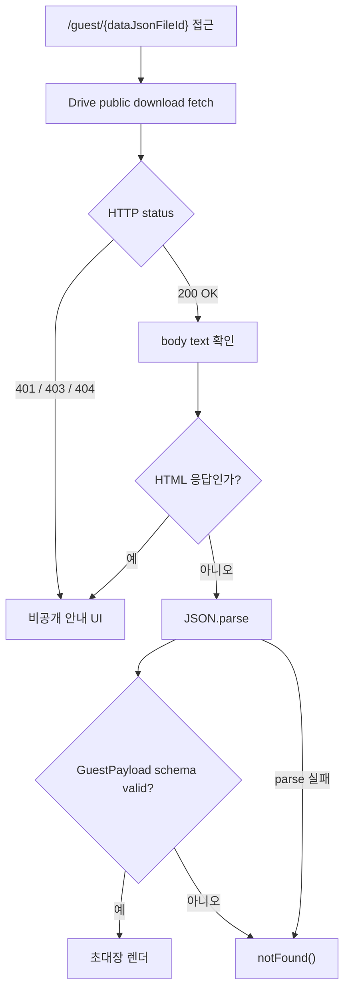

코드 위치:

```txt
app/guest/[id]/page.tsx
```

처리한 문제:

- 비공개 Drive 파일이 항상 `403` 또는 `404`로만 오지 않는다.
- 공개 URL fetch가 `200 OK`인데 body가 JSON이 아니라 `<!doctype ...` HTML인 경우가 있다.
- `generateMetadata()`에서도 같은 응답을 JSON으로 파싱하다가 콘솔 SyntaxError가 발생했다.

현재 정책:

- `401`, `403`, `404`는 비공개 안내 UI로 처리한다.
- `200 OK`여도 body가 HTML이면 비공개 안내 UI로 처리한다.
- `generateMetadata()`는 HTML 또는 JSON 파싱 실패 시 `{}`를 반환해 콘솔 SyntaxError를 만들지 않는다.

---

## 11. 모듈화 지도

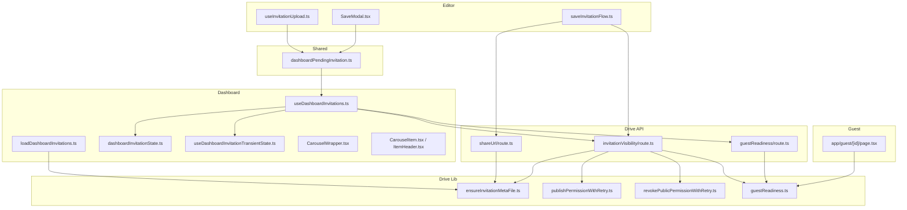

---

## 12. 과거 기능이 현재 어디로 이동했는가

| 과거 기능                 | 과거 위치                                              | 현재 위치                                                | 설명                                                                  |
| ------------------------- | ------------------------------------------------------ | -------------------------------------------------------- | --------------------------------------------------------------------- |
| 저장 성공 후 발행 유도    | `SaveModal`, `useInvitationPublish`                    | `SaveModal`, `useInvitationUpload`, `saveInvitationFlow` | 저장 성공 후 "초대장 URL 만들기" 대신 "여기서 나가기"로 대시보드 이동 |
| 발행 hook                 | `widgets/editor/preview/hooks/useInvitationPublish.ts` | 제거됨                                                   | 에디터에서 발행 책임 제거                                             |
| 공개 권한 부여            | `publishInvitation` 중심                               | `invitationVisibility`                                   | 공개/비공개를 하나의 API에서 처리                                     |
| 공개 권한 회수            | 없음                                                   | `revokePublicPermissionWithRetry`                        | 초대장 폴더의 `anyone` permission 삭제                                |
| published 상태 저장       | `published.json`                                       | `meta.json.published`                                    | 공개 여부의 SSOT를 `meta.json`으로 이동                               |
| 카카오 공유 메타 저장     | `kakao-share.json`                                     | `meta.json.kakaoShare`                                   | 기존 파일 fallback 제거, `shareUrl` API 이름만 유지                   |
| guest URL                 | `publishedUrl`                                         | `guestUrl`                                               | 런타임 타입과 훅에서 `guestUrl`로 통일                                |
| readiness probe           | publish 액션 내부                                      | `guestReadiness`, pending polling, 공개 토글 후 polling  | 공개 전환 또는 방금 만든 공개 초대장에 집중                           |
| 방금 만든 초대장 보정     | 없음                                                   | sessionStorage pending handoff                           | Drive 목록 전파 지연을 대시보드 카드 단위로 흡수                      |
| 비공개 초대장 게스트 접근 | 404                                                    | 비공개 안내 UI                                           | Drive 401/403/404 및 HTML 응답 처리                                   |
| 초기 카드 이미지 표시     | 렌더 후 이미지 로드                                    | 초기 5개 preload + fallback                              | 캐러셀 첫 화면의 끊김 완화                                            |

---

## 13. 레거시 제거 결과와 남은 정리 후보

이번 잔재 정리로 런타임 코드의 주요 호환 경로는 제거되었다.

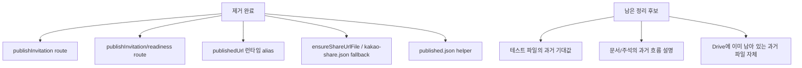

제거된 런타임 항목:

- `app/api/drive/publishInvitation/route.ts`
- `app/api/drive/publishInvitation/readiness/route.ts`
- `app/api/drive/_lib/ensureShareUrlFile.ts`
- `app/api/drive/_lib/ensurePublishedJsonFile.ts`
- `InviteListItem.publishedUrl`
- `useDashboardInvitations`의 `handlePublish`, `getPublishedUrl`, `handleCopyPublishedUrl`, `isPublishing` 계열 alias
- `shareUrl` API의 `kakao-share.json` 검색/다운로드 fallback

현재 유지하는 항목:

- `/api/drive/shareUrl` 경로 이름
  - 외부 의미는 여전히 "공유 데이터 저장/조회"이므로 이름은 유지한다.
  - 내부 구현은 `meta.json.kakaoShare` 전용이다.
- 초대장 폴더 단위 permission 정책
  - 비공개 전환 시 하위 파일을 순회하지 않고 초대장 폴더의 `anyone` permission만 제거한다.

남은 정리 후보:

- 테스트 파일들
  - 일부 테스트는 여전히 `publishInvitation`, `publishedUrl`, `kakao-share.json` fallback을 기대한다.
  - 사용자가 테스트 정리는 나중에 한 번에 한다고 했으므로 이번 정리에서는 건드리지 않았다.
- 기존 Drive 데이터
  - 이미 생성된 `published.json` 또는 `kakao-share.json` 파일 자체는 Drive에 남아 있을 수 있다.
  - 런타임 코드는 더 이상 해당 파일을 읽지 않는다.

---

## 14. 현재 구조에서의 상태 전이

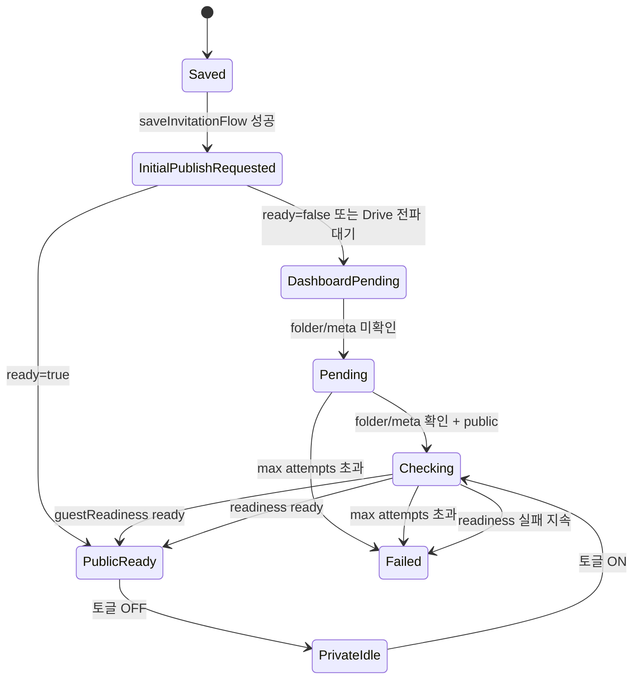

상태 의미:

| 상태       | 의미                                                                           |
| ---------- | ------------------------------------------------------------------------------ |
| `idle`     | 비공개이거나 readiness 확인이 필요 없는 일반 상태                              |
| `pending`  | 방금 만든 초대장이 Drive 목록 또는 `meta.json`에 아직 반영되지 않음            |
| `checking` | `guestUrl`과 `dataJsonFileId`는 있지만 게스트 data.json 접근 가능 여부 확인 중 |
| `ready`    | 공개 초대장으로 게스트 페이지 접근 가능하다고 판단                             |
| `failed`   | pending 또는 readiness 확인이 제한 횟수 내 완료되지 않음                       |

---

## 15. 기능별 검증 관점

수동 확인 시 다음 시나리오를 보면 된다.

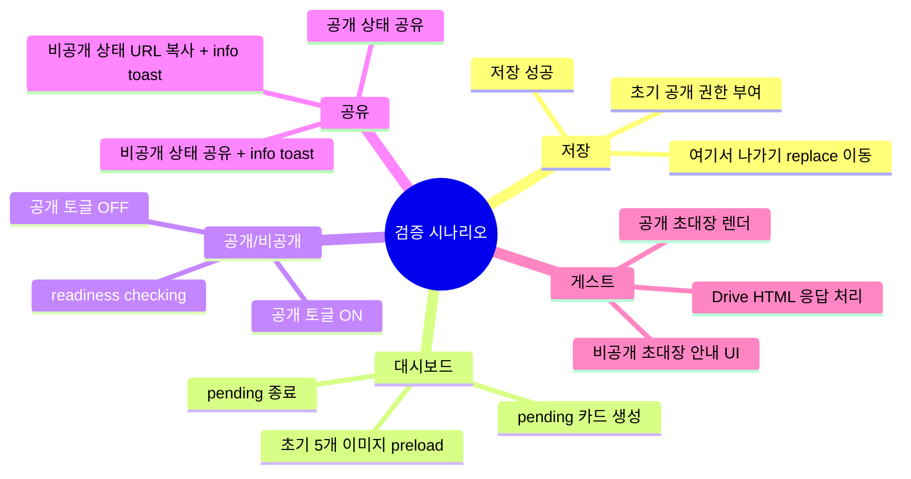

---

## 16. 요약

현재 리팩토링은 다음 방향으로 거의 정리된 상태다.

- 에디터는 저장과 대시보드 handoff만 담당한다.
- 저장 과정에서 `meta.json` 저장과 초기 공개 권한 요청까지 수행한다.
- 대시보드는 방금 만든 초대장의 Drive 전파 지연을 pending 카드로 흡수한다.
- 공개/비공개 상태는 `meta.published`와 Drive folder permission이 함께 움직인다.
- readiness probe는 모든 카드에 무차별 실행하지 않고, 방금 만든 공개 초대장과 공개 전환 액션에 집중한다.
- 공유/URL 복사는 공개 여부와 독립적으로 동작하되, 비공개 상태에서는 안내 toast를 먼저 보여준다.
- 비공개 guest 접근은 404 대신 전용 안내 UI로 처리한다.

남은 작업은 큰 구조 변경보다 **테스트 정리와 문서/주석 정리**에 가깝다. 런타임 기준으로는 `publishInvitation`, `publishedUrl`, `kakao-share.json` fallback이 제거되었고, 새 구조는 `meta.json`, `guestUrl`, `invitationVisibility`, `guestReadiness` 중심으로 통일되었다.
