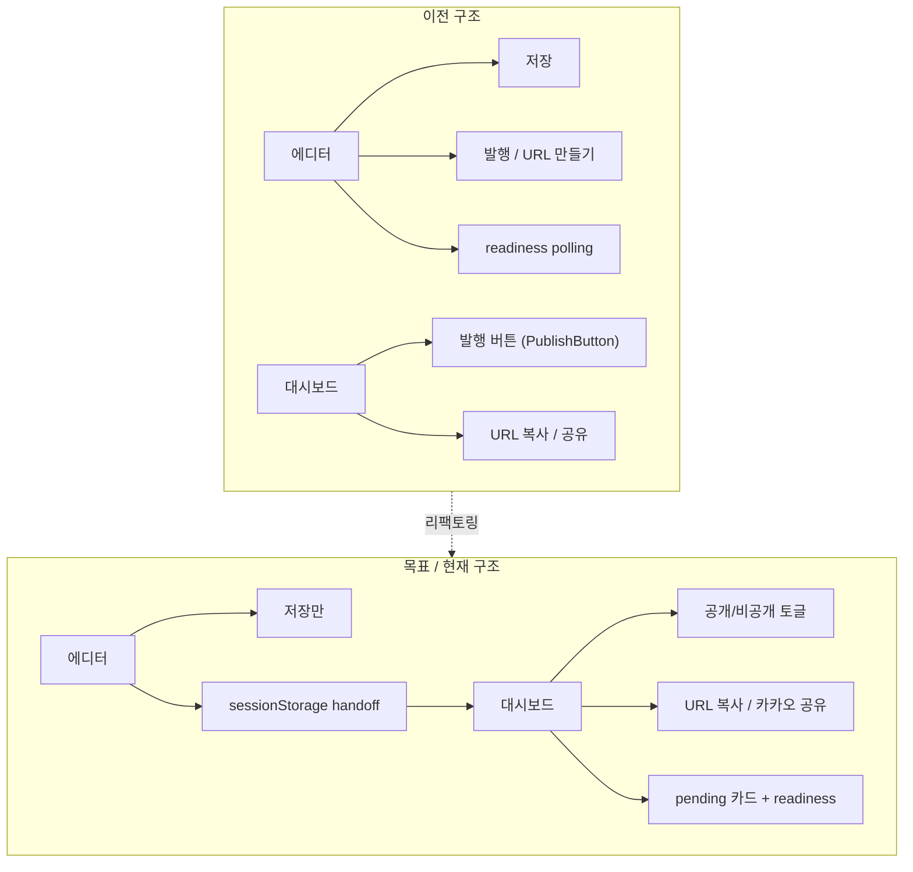
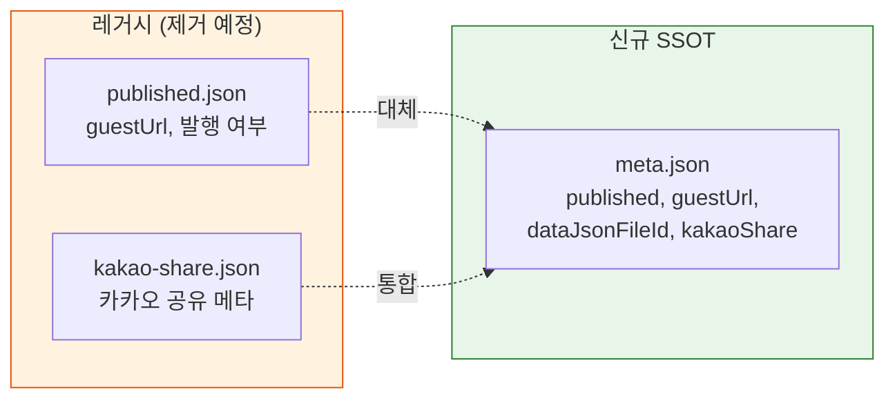
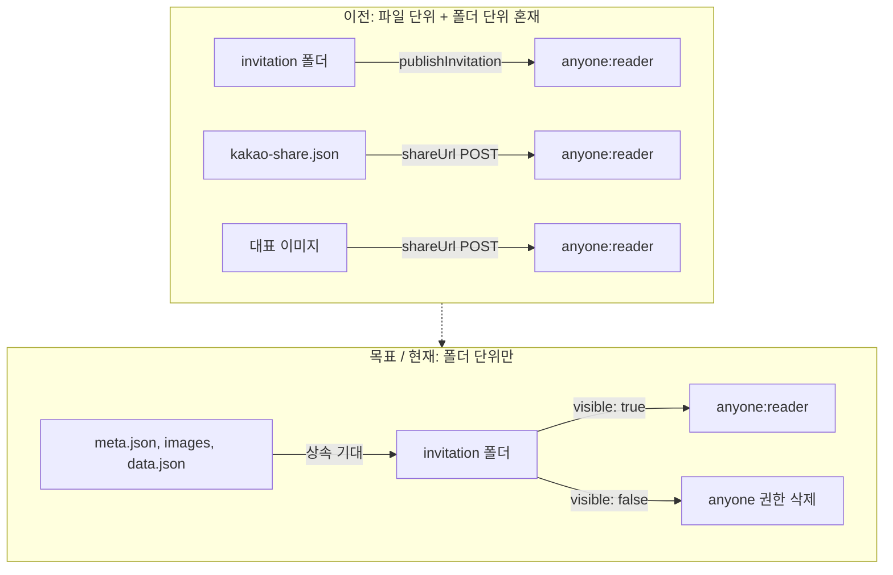
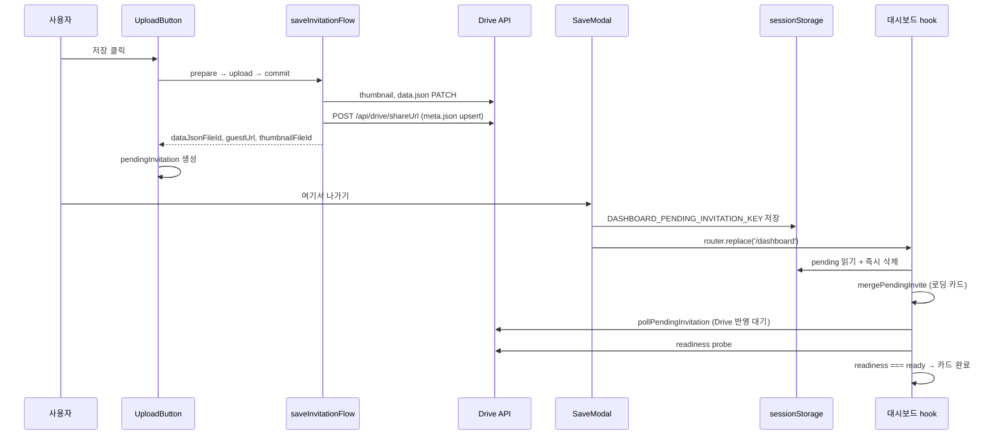
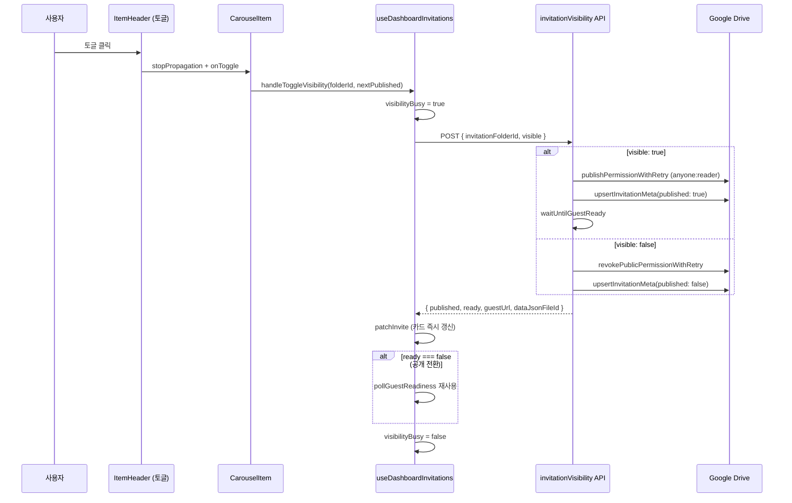
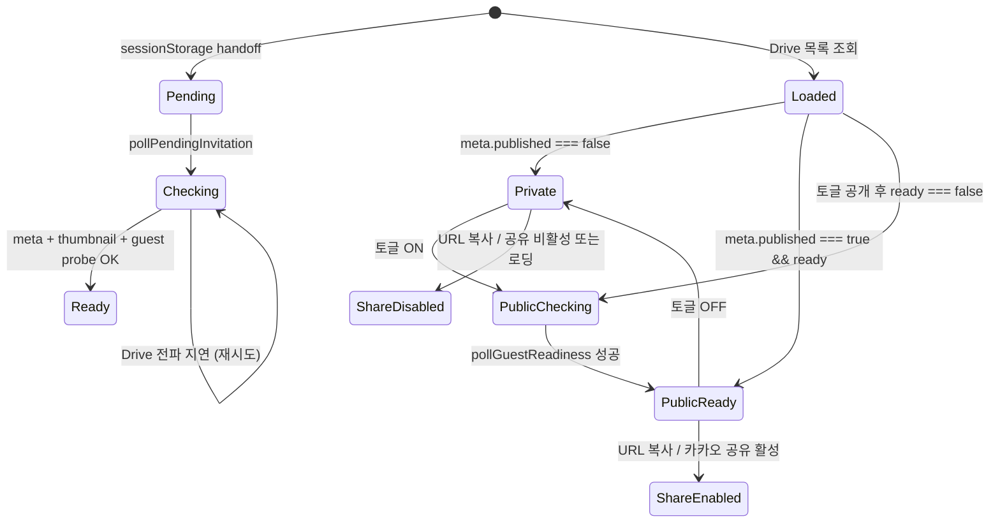
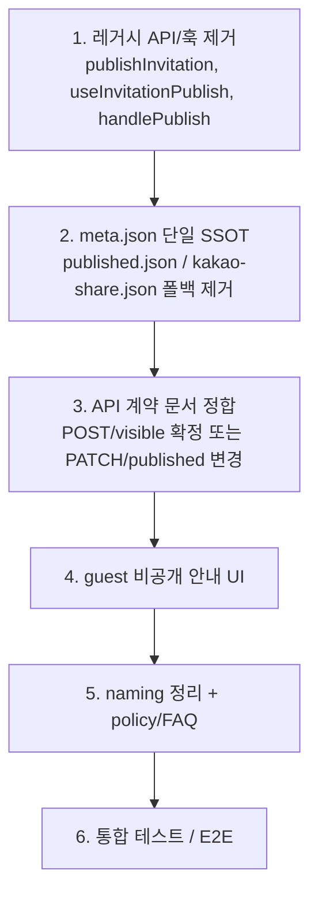

# 에디터·대시보드 저장 플로우 리팩토링 — 중간 진행 리포트

> ⚠️ 이 문서는 중간 진행 기록입니다. 현재 코드 기준 최종 상태는
> [`editor-dashboard-save-refactor-final-report.md`](./editor-dashboard-save-refactor-final-report.md)를
> 기준으로 확인하세요. 특히 `publishInvitation`, `publishedUrl`, `published.json`,
> `kakao-share.json` fallback 관련 내용은 이후 작업에서 제거되었습니다.

> 작성일: 2026-06-10  
> 브랜치: `refactor/page/save-flow`  
> 기준 문서: [`editor-dashboard-save-refactor.md`](./editor-dashboard-save-refactor.md)  
> 상태: **진행 중** (staged 변경 기준, 커밋 전)

---

## 1. 한 줄 요약

**에디터는 저장만, 공개/공유/URL 관리는 대시보드로** 옮기는 방향으로 핵심 골격이 잡혔다.  
`meta.json` 단일화, `invitationVisibility` API, pending 카드 handoff, 카드 토글 UI는 **동작 가능한 수준**까지 구현됐고, `published.json` / `kakao-share.json` / 레거시 publish 경로 **정리가 남아 있다**.

---

## 2. 리팩토링 목표 vs 현재 진행도

| #   | 목표 (문서)                                             | 현재 상태  | 비고                                        |
| --- | ------------------------------------------------------- | ---------- | ------------------------------------------- |
| 1   | 에디터 저장 전용 UX (`다시 수정하기` / `여기서 나가기`) | ✅ 완료    | 발행/URL 복사 UI 제거                       |
| 2   | 저장 응답 계약 + `meta.json` (실패 시 저장 실패)        | 🟡 부분    | `meta.json` upsert 연결됨, 레거시 폴백 잔존 |
| 3   | `sessionStorage` pending 카드 intake                    | ✅ 완료    | 읽은 즉시 삭제 정책 적용                    |
| 4   | 새 visibility API (공개/비공개)                         | ✅ 완료    | 문서와 경로·필드명 차이 있음                |
| 5   | 대시보드 공개/비공개 토글                               | ✅ 완료    | `ItemHeader` 스위치 UI                      |
| 6   | 대시보드 공유·URL 복사 (`meta.guestUrl` 기준)           | 🟡 부분    | 동작하나 `publishedUrl` naming 잔존         |
| 7   | guest 비공개 안내 UI                                    | ❌ 미구현  | 여전히 `notFound()`                         |
| 8   | `published.json` / publish API 마이그레이션             | 🟡 진행 중 | 이중 쓰기·폴백 병행                         |
| 9   | 테스트                                                  | 🟡 부분    | visibility, shareUrl, hook 테스트 추가      |

**범례:** ✅ 완료 · 🟡 부분 · ❌ 미구현

---

## 3. 아키텍처 변화 (Before → After)

### 3.1 책임 분리



### 3.2 Drive 메타데이터 파일 구조



**`meta.json` 스키마 (현재 구현):**

```ts
// app/api/drive/_lib/ensureInvitationMetaFile.ts
type InvitationMetaPayload = {
  version: 1;
  published: boolean; // 기본값 false
  guestUrl: string | null;
  dataJsonFileId: string | null;
  kakaoShare: ShareUrlPayload | null; // 문서는 share, 구현은 kakaoShare
  updatedAt: string;
};
```

### 3.3 공개 권한 모델



---

## 4. 기능 이전 맵 (FROM → TO)

### 4.1 총괄 표

| 기능                    | 이전 위치                              | 현재 / 목표 위치                                  | 상태         |
| ----------------------- | -------------------------------------- | ------------------------------------------------- | ------------ |
| 저장 성공 후 액션       | `SaveModal` → `초대장 URL 만들기`      | `SaveModal` → `여기서 나가기` → `/dashboard`      | ✅           |
| 발행 API 호출           | `useInvitationPublish` (에디터)        | **제거** (orphan 파일만 남음)                     | 🟡           |
| 발행 API 호출           | `handlePublish` (대시보드)             | `handleToggleVisibility` → `invitationVisibility` | 🟡 병행      |
| readiness polling       | 에디터 publish hook                    | 대시보드 pending / 토글 후                        | ✅           |
| 발행 상태 저장          | `published.json` 생성                  | `meta.published` boolean                          | 🟡 이중 쓰기 |
| 공유 메타 저장          | `kakao-share.json` + 파일 공개         | `meta.json` (`kakaoShare`)                        | 🟡 폴백 유지 |
| 공개 권한 부여          | `publishInvitation`, `shareUrl`        | `invitationVisibility` (폴더만)                   | 🟡           |
| 공개 권한 회수          | 없음                                   | `revokePublicPermissionWithRetry`                 | ✅ 신규      |
| 목록 조회 published     | `published.json` 검색                  | `meta.json` + `published.json` 폴백               | 🟡           |
| 발행 UI                 | `PublishButton`, `PublishedUrlActions` | `ItemHeader` 토글 스위치                          | ✅           |
| 에디터→대시보드 handoff | 없음                                   | `sessionStorage` pending payload                  | ✅           |

### 4.2 컴포넌트 / 훅 트리

```
widgets/editor/preview/
├── SaveModal.tsx              [변경] 발행 UI 제거 → 다시 수정하기 / 여기서 나가기
├── UploadButton.tsx           [변경] pendingInvitation 전달
├── hooks/
│   ├── useInvitationUpload.ts [변경] pending payload 생성, save 결과 확장
│   └── useInvitationPublish.ts [레거시] import 없음, 삭제 대기

app/dashboard/
├── hooks/useDashboardInvitations.ts
│   ├── handleToggleVisibility  [신규] → POST /api/drive/invitationVisibility
│   ├── handlePublish           [레거시] → POST /api/drive/publishInvitation (UI 미연결)
│   ├── pollPendingInvitation   [신규] pending 카드 완료 대기
│   └── pollGuestReadiness      [유지] 토글/pending 후 재사용
├── components/carousel/
│   ├── CarouselWrapper.tsx     [변경] handleToggleVisibility 연결
│   ├── item/ItemHeader.tsx     [변경] PublishButton → 토글 스위치
│   └── item/CarouselItem.tsx   [변경] canToggleVisibility, pending overlay
└── server/loadDashboardInvitations.ts [변경] meta.json 우선, published.json 폴백

app/api/drive/
├── _lib/
│   ├── ensureInvitationMetaFile.ts      [신규] meta.json CRUD
│   └── revokePublicPermissionWithRetry.ts [신규] anyone 권한 삭제
├── invitationVisibility/route.ts      [신규] 공개/비공개 토글 API
├── shareUrl/route.ts                    [변경] meta.json upsert, 파일 공개 제거
└── publishInvitation/route.ts           [레거시] published.json + meta 이중 쓰기

shared/constants/
└── dashboardPendingInvitation.ts        [신규] sessionStorage 키·타입
```

---

## 5. 핵심 데이터 흐름

### 5.1 에디터 저장 → 대시보드 진입



**handoff payload:**

```ts
// shared/constants/dashboardPendingInvitation.ts
{
  invitationFolderId, invitationUuid,
  dataJsonFileId, guestUrl,
  thumbnailFileId?, createdAt
}
```

### 5.2 대시보드 공개/비공개 토글



**`revokePublicPermissionWithRetry` 핵심 동작:**

1. `permissions` 목록에서 `type === 'anyone'` 조회
2. permission id로 DELETE (재시도 포함)
3. 이미 비공개면 `{ ok: true, ignored: 'not_public' }` — 성공 처리
4. DELETE 404도 동일하게 성공 처리

---

## 6. API 계약 변화

### 6.1 신규: `/api/drive/invitationVisibility`

| 항목        | 문서 제안                 | **현재 구현**                                      |
| ----------- | ------------------------- | -------------------------------------------------- |
| HTTP 메서드 | `PATCH`                   | `POST`                                             |
| 요청 필드   | `published: boolean`      | `visible: boolean`                                 |
| 응답        | `invitationFolderId` 포함 | `guestUrl`, `dataJsonFileId`, `published`, `ready` |

**공개 전환 (`visible: true`):**

```
ensureDataJsonFile → publishPermissionWithRetry
→ upsertInvitationMeta(published: true)
→ waitUntilGuestReady → revalidate cache
```

**비공개 전환 (`visible: false`):**

```
ensureDataJsonFile → revokePublicPermissionWithRetry
→ upsertInvitationMeta(published: false)
→ revalidate cache
```

### 6.2 변경: `/api/drive/shareUrl`

|      | 이전                                       | 현재                                                |
| ---- | ------------------------------------------ | --------------------------------------------------- |
| POST | `kakao-share.json` 생성 + 파일/이미지 공개 | `upsertInvitationMeta` (공유 데이터 → `kakaoShare`) |
| GET  | `kakao-share.json`만                       | `meta.json` 우선, `kakao-share.json` 폴백           |

### 6.3 레거시 유지: `/api/drive/publishInvitation`

- `ensurePublishedJsonFile` + `upsertInvitationMeta` **이중 쓰기**
- `handlePublish` (대시보드 hook)에서만 호출 가능, **UI는 토글로 대체됨**
- `publishInvitation/readiness` — pending·토글 후 probe에 **여전히 사용**

---

## 7. 대시보드 카드 상태 모델



**카드 필드 (`InviteListItem` 확장):**

| 필드           | 의미                                              |
| -------------- | ------------------------------------------------- |
| `published`    | `meta.published` (폴백: `published.json` 존재)    |
| `guestUrl`     | `meta.guestUrl` (폴백: `published.json.guestUrl`) |
| `publishedUrl` | 레거시 alias — TODO: `guestUrl`로 통합            |
| `readiness`    | `ready` / `checking` / `error`                    |
| `isPending`    | sessionStorage handoff 또는 probe 미완료          |

---

## 8. 변경 파일 목록 (staged 기준)

총 **24개 파일** (+1046 / -106 줄, API·대시보드·에디터 전반)

### 신규 (6)

| 파일                                                    | 역할                  |
| ------------------------------------------------------- | --------------------- |
| `app/api/drive/_lib/ensureInvitationMetaFile.ts`        | `meta.json` SSOT      |
| `app/api/drive/_lib/revokePublicPermissionWithRetry.ts` | anyone 권한 회수      |
| `app/api/drive/invitationVisibility/route.ts`           | 공개/비공개 API       |
| `app/api/drive/invitationVisibility/route.test.ts`      | API 테스트            |
| `app/api/drive/shareUrl/route.test.ts`                  | meta 우선 조회 테스트 |
| `shared/constants/dashboardPendingInvitation.ts`        | handoff 상수          |

### 주요 수정 (18)

| 영역          | 파일                                                          |
| ------------- | ------------------------------------------------------------- |
| 저장 플로우   | `features/invitation/save/saveInvitationFlow.ts`              |
| 에디터 UI     | `SaveModal.tsx`, `UploadButton.tsx`, `useInvitationUpload.ts` |
| 대시보드 hook | `useDashboardInvitations.ts`, `.test.tsx`                     |
| 대시보드 UI   | `CarouselBase/Track/Wrapper`, `CarouselItem`, `ItemHeader`    |
| 서버 조회     | `loadDashboardInvitations.ts`, `types.ts`                     |
| API           | `shareUrl/route.ts`, `publishInvitation/route.ts` + tests     |

---

## 9. 아직 남은 작업 (WIP 체크리스트)

### 높은 우선순위

- [ ] `published.json` 완전 제거 (`ensurePublishedJsonFile`, `loadPublishedUrl` 폴백)
- [ ] `kakao-share.json` 완전 제거 (`ensureShareUrlFile` 폴백, dead code)
- [ ] `publishInvitation` API + `handlePublish` + `useInvitationPublish` 정리
- [ ] `publishedUrl` → `guestUrl` naming 통일
- [ ] `publish*` 상태명 → `visibility*` 로 정리

### 중간 우선순위

- [ ] visibility API 계약 문서와 정합 (`PATCH`/`published` vs `POST`/`visible`)
- [ ] `meta.kakaoShare` vs 문서 `meta.share` 스키마 통일
- [ ] `readiness` route — 비공개 초대장 응답 의미 정리
- [ ] guest 페이지 비공개 안내 UI (현재 `notFound()`)
- [ ] policy/FAQ "발행" 문구 → "공개" 중심 갱신

### 낮은 우선순위 / 보류

- [ ] `sessionStorage` 삭제 시점 최종 정책 (현재: 읽을 때 즉시 삭제)
- [ ] Figma 기준 최종 카드 UI
- [ ] 부모 폴더 권한 상속 Drive 실동작 검증

---

## 10. 문서 vs 구현 차이 메모

| 항목                       | 문서                                    | 구현                             |
| -------------------------- | --------------------------------------- | -------------------------------- |
| visibility API 경로/메서드 | `PATCH /api/drive/invitationVisibility` | `POST`, body `visible`           |
| meta 공유 필드명           | `share`                                 | `kakaoShare`                     |
| sessionStorage 삭제        | 보류                                    | mount 시 읽고 즉시 삭제          |
| shareUrl 실패 처리         | meta 실패 = 저장 실패                   | 코드 반영됨 (`metaSaveFailed`)   |
| PublishButton              | 토글로 교체                             | 삭제됨, ItemHeader 스위치로 대체 |

---

## 11. 다음 작업 제안 (권장 순서)



---

## 12. 참고 링크 (코드 위치)

| 주제                | 경로                                                                             |
| ------------------- | -------------------------------------------------------------------------------- |
| 리팩토링 계획       | `docs/editor-dashboard-save-refactor.md`                                         |
| 저장 오케스트레이션 | `features/invitation/save/saveInvitationFlow.ts`                                 |
| 에디터 저장 모달    | `widgets/editor/preview/components/SaveModal.tsx`                                |
| pending handoff     | `shared/constants/dashboardPendingInvitation.ts`                                 |
| meta.json           | `app/api/drive/_lib/ensureInvitationMetaFile.ts`                                 |
| visibility API      | `app/api/drive/invitationVisibility/route.ts`                                    |
| 권한 회수           | `app/api/drive/_lib/revokePublicPermissionWithRetry.ts`                          |
| 대시보드 토글 hook  | `app/dashboard/hooks/useDashboardInvitations.ts` (L823 `handleToggleVisibility`) |
| 토글 UI             | `app/dashboard/components/carousel/item/ItemHeader.tsx`                          |

---

_이 문서는 리팩토링 중간 시점 스냅샷입니다. 작업이 진행되면 WIP 체크리스트와 진행도 표를 갱신하세요._
